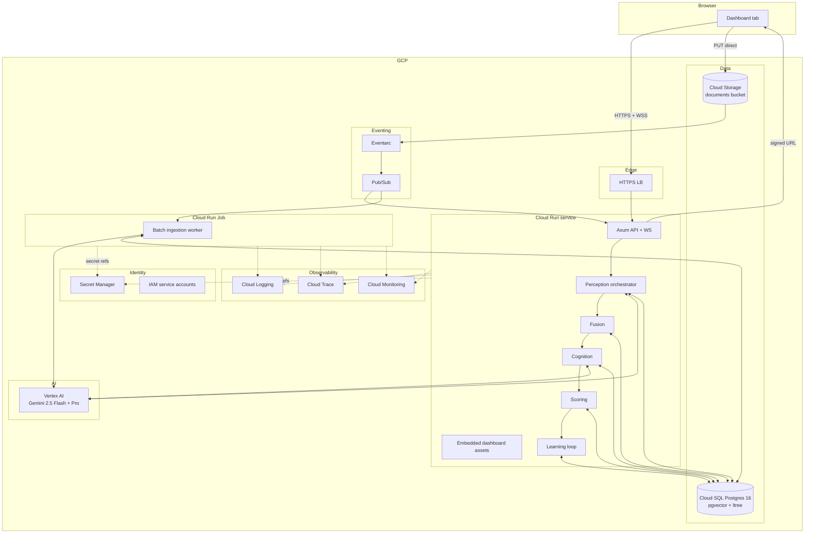

# AGON Architecture

*The technical contract for a GCP-native deployment. A senior Rust engineer (or coding agent) should be able to build AGON end-to-end from this document plus [BUILDPLAN.md](./BUILDPLAN.md). The Rust code runs only on Cloud Run; storage lives in Cloud SQL; the LLM is reached through Vertex AI; deployment is from GitHub through Cloud Build. No part of the production runtime executes on a developer laptop.*

This v3 supersedes earlier architectures. The major shifts vs v2: Cloud SQL replaces local Postgres, Vertex AI replaces direct Gemini API, Cloud Run replaces docker-compose, and a full Terraform IaC + Cloud Build CI/CD pipeline is part of the deliverable.

---

## Table of contents

1. [Design principles](#1-design-principles)
2. [The Tesla pipeline on GCP](#2-the-tesla-pipeline-on-gcp)
3. [Crate workspace](#3-crate-workspace)
4. [The ACO ontology — primitives and interpersonal extensions](#4-the-aco-ontology--primitives-and-interpersonal-extensions)
5. [Perception layer (parallel extractors via Vertex AI)](#5-perception-layer-parallel-extractors-via-vertex-ai)
6. [Fusion layer (canonicalization)](#6-fusion-layer-canonicalization)
7. [Storage — Cloud SQL for Postgres](#7-storage--cloud-sql-for-postgres)
8. [Cognition layer — inference](#8-cognition-layer--inference)
9. [Scoring framework](#9-scoring-framework)
10. [Surface layer — Cloud Run dashboard + API](#10-surface-layer--cloud-run-dashboard--api)
11. [Learning loop](#11-learning-loop)
12. [GCP service map](#12-gcp-service-map)
13. [Infrastructure as code (Terraform)](#13-infrastructure-as-code-terraform)
14. [Deployment flow (Cloud Build)](#14-deployment-flow-cloud-build)
15. [Performance targets](#15-performance-targets)
16. [Testing strategy](#16-testing-strategy)
17. [Security and IAM](#17-security-and-iam)
18. [Licensing posture](#18-licensing-posture)
19. [Risk register](#19-risk-register)
20. [Citations](#20-citations)

---

## 1. Design principles

**P0 — GCP-native, not GCP-compatible.** Every component is specified against a concrete GCP service. There is no abstraction layer pretending to be cloud-portable. Cloud SQL is the database. Vertex AI is the LLM endpoint. Cloud Run is the runtime. Cloud Build is the CI/CD. Secret Manager is the secret store. This makes the system simpler, cheaper, faster, and safer than a multi-cloud abstraction would.

**P1 — Perception, not summarisation.** AGON does not paraphrase. It perceives typed entities, events, and patterns and stores them with full provenance.

**P2 — Typed primitives, not RDF triples.** The eight ACO primitives are first-class Rust types. Interpersonal-conflict patterns are typed extensions.

**P3 — LLM as typed sensor.** Every Vertex AI call is constrained by a JSON schema derived from the type system. The LLM perceives; AGON reasons.

**P4 — Canonicalization is mandatory.** Nothing reaches Cloud SQL without passing through fusion. Pre-canonical hash signatures and embedding signatures resolve entities across documents before storage.

**P5 — Provenance is mandatory.** Every primitive carries extractor identity, prompt fingerprint, evidence span, confidence, defeasibility, derivation chain. Every score has a derivation back to spans.

**P6 — One database.** Cloud SQL for Postgres 16 with `pgvector` is the source of truth. The in-memory `petgraph` is a derived hot working set, rehydrated from Postgres on Cloud Run cold start.

**P7 — Sovereign reasoning.** `ascent` (Datalog), `z3` (SMT), `good_lp` (LP/MILP), and calibrated scoring all run in-process on Cloud Run. No remote inference service beyond Vertex AI for extraction.

**P8 — Audit by clicking.** Every conclusion traces backward to spans. The dashboard renders the derivation tree on demand.

**P9 — Reproducibility.** Same inputs + same prompt versions = same world model + same scores. Prompt versions are pinned in `prompts/manifest.json`; corrections become a few-shot example bank tied to the version that made the error.

**P10 — Learn from corrections.** Every user correction in the dashboard is logged with primitive ID, correction type, and extractor version. Retraining triggers when thresholds are crossed.

**P11 — Speed is a feature.** 50 pages → fully analyzed in under 2 minutes wall time on a Cloud Run instance with one vCPU and 1 GiB. Inference closure under 100ms on 5k primitives. Dashboard updates at 60fps. Cold-start under 4 seconds.

**P12 — Push to deploy.** A developer pushes to `main`. Cloud Build runs. The dev environment is updated. There is no manual deploy step. There is no "build artifact" to upload.

**P13 — Service-account auth everywhere.** No API keys in source, no API keys in env vars at rest. Vertex AI is reached via the Cloud Run service account. Cloud SQL is reached via IAM database authentication (preferred) or via Secret Manager password (acceptable). Cloud Storage signed URLs are minted with service-account credentials.

---

## 2. The Tesla pipeline on GCP

Each stage runs concurrently as much as the dataflow permits. Each stage has a hard timeout. Each stage emits structured events the next stage consumes.



**Why two compute surfaces:**

- **Cloud Run service** is autoscaling 0→N, serves the HTTP/WS API and the dashboard, handles interactive workflows (run a single query, regenerate a brief, accept a correction). Maximum request timeout is 60 minutes — fine for typical interactive use.
- **Cloud Run Job** handles batch ingestion of dossiers larger than ~30 minutes of processing. The Eventarc trigger fans uploads above a threshold to a Job invocation instead of the service. Jobs can run up to 24 hours and are billed only for the run duration.

Both compile from the same Rust binary with different entry points (`agon-server` and `agon-job`).

---

## 3. Crate workspace

```
crates/
├── aco-core/        level 0: primitives, IDs, errors, provenance
├── aco-llm/         level 1: Vertex AI Gemini client; LlmBackend trait
├── aco-embed/       level 1: fastembed + similarity
├── aco-storage/     level 1: sqlx + Cloud SQL connection mgmt; in-memory petgraph
├── aco-perceive/    level 2: parallel extractors
├── aco-fuse/        level 2: canonicalization
├── aco-infer/       level 3: ascent + z3 + good_lp + abduction
├── aco-score/       level 3: friction / risk / power / trust / repair scoring
├── aco-learn/       level 3: correction log + active learning
├── aco-server/      level 4: Axum HTTP/WS + dashboard + Eventarc handler (binary: agon-server)
├── aco-job/         level 4: Cloud Run Job worker (binary: agon-job)
├── aco-cli/         level 4: thin client over deployed API (binary: agon-cli)
└── aco-bench/       benches
```

Dependencies flow strictly downward.

### Crate responsibilities (delta from earlier versions)

**`aco-llm` — Vertex AI Gemini client.** Uses `google-cloud-aiplatform` or hand-rolled `reqwest` against the Vertex AI Generative AI endpoint. Auth is via the Cloud Run service-account token (`gcp_auth` crate or `google-cloud-auth`). No API key in code or env vars at rest.

```rust
#[async_trait]
pub trait LlmBackend: Send + Sync {
    async fn extract<T: AsSchema + DeserializeOwned + Send>(
        &self,
        system: &str,
        user: &str,
        ctx: Option<&CachedContext>,
    ) -> Result<T, LlmError>;
    async fn rank_hypotheses(&self, gap: &Gap, candidates: Vec<RawHypothesis>) -> Result<Vec<RankedHypothesis>, LlmError>;
    async fn embed(&self, texts: &[String]) -> Result<Vec<Vec<f32>>, LlmError>;
    fn cost_so_far(&self) -> CostReport;
}

pub struct VertexAiBackend {
    project_id: String,
    location: String,
    model_flash: String,                  // "gemini-2.5-flash"
    model_pro: String,                    // "gemini-2.5-pro"
    auth: gcp_auth::AuthenticationManager,
    http: reqwest::Client,
    rate_limiter: governor::DefaultDirectRateLimiter,
    cache: PostgresLlmCache,
}
```

**`aco-storage` — Cloud SQL.** `sqlx` with `postgres` and `runtime-tokio` features. Connection pool sized for Cloud Run concurrency (`max_connections = 5` per instance is a sensible default — Cloud Run autoscales instance count, so total connections = instances × pool size). Migrations applied as a pre-deploy step in Cloud Build.

**`aco-server` — Cloud Run service binary.** Listens on `$PORT` (Cloud Run env var). Serves HTTPS API + WebSocket + embedded dashboard. Receives Eventarc HTTP push events at `/api/eventarc/upload`. Runs perception → fusion → cognition → scoring inline for small dossiers; offloads to Cloud Run Job for large ones (using `gcloud_run_jobs` API to invoke).

**`aco-job` — Cloud Run Job binary.** Reads its job parameters from env vars (`AGON_JOB_DOC_PREFIX`, `AGON_JOB_USER_ID`). Same pipeline as the service, no HTTP surface. Exit codes signal success/failure to Cloud Run Jobs.

**`aco-cli` — thin remote client.** Calls the deployed API over HTTPS. Auth via IAM (the developer's gcloud credentials are used for identity-token signing).

---

## 4. The ACO ontology — primitives and interpersonal extensions

Identical to v2 (no GCP-specific changes). The eight primitives — Actor, Claim, Interest, Constraint, Leverage, Commitment, Event, Narrative — plus interpersonal extensions (`PatternFinding`, `AffectMarker`, `BidForConnection`, `RepairAttempt`) are documented in code at `crates/aco-core/src/`. See v2 architecture §4 for full field-by-field specifications. The coding agent should implement these verbatim.

---

## 5. Perception layer (parallel extractors via Vertex AI)

The perception layer is the multi-camera array. Each extractor is a small Tokio task with its own JSON schema, system prompt, rate budget, and verify-and-repair loop. They run in parallel on the same chunk against Vertex AI Gemini.

### 5.1 Vertex AI integration specifics

- **Endpoint**: `https://{region}-aiplatform.googleapis.com/v1/projects/{project}/locations/{region}/publishers/google/models/{model}:generateContent`
- **Auth**: Cloud Run service account → metadata server → bearer token
- **Models**: `gemini-2.5-flash` for hot extraction, `gemini-2.5-pro` for critique/abduction
- **Region**: `us-central1` default; `europe-west4` for EU residency (configurable via env var)
- **Structured output**: `response_mime_type: "application/json"` + `response_schema: <schema>`
- **Context caching**: Vertex AI's `cachedContent` resource; 90% discount on cached prefix; minimum 32k tokens cached; default 1h TTL
- **Function calling**: used for the alias-merge tool and the span-verify tool
- **Rate limits**: typical project quota is 60 requests/minute for `gemini-2.5-flash` (higher with quota raise); the global semaphore in `aco-llm` enforces the limit across all extractors

### 5.2 Extractor architecture, schema design rules, span verification, verify-and-repair loop

Identical to v2 §5 with one substitution: every "Gemini" reference now means "Vertex AI Gemini." The JSON schema feature support, structured-output behaviour, and prompt design rules are the same — Vertex AI Gemini uses the same model family as direct API. The implementation difference is only in the auth and endpoint.

---

## 6. Fusion layer (canonicalization)

Identical to v2 §6. The fusion layer runs entirely in-process on Cloud Run. The HNSW ANN index is rebuilt on cold start from the canonical embedding columns in Cloud SQL (`vector(384)` columns indexed with `hnsw vector_cosine_ops`). The Gemini tiebreaker uses Vertex AI as in §5.

---

## 7. Storage — Cloud SQL for Postgres

### 7.1 Cloud SQL configuration

- **Edition**: Cloud SQL Enterprise (sufficient for v1.0; Enterprise Plus only if you need 99.99% SLA later)
- **Version**: PostgreSQL 16
- **Tier**: `db-f1-micro` for dev ($7-10/mo), `db-g1-small` for prod ($25-40/mo), `db-custom-2-7680` for heavy workloads
- **Storage**: 10 GB SSD default, auto-grow enabled, daily backups, 7-day retention
- **High availability**: regional (multi-zone) for prod, zonal for dev
- **Connectivity**: private IP only via Direct VPC Egress from Cloud Run. No public IP. No Cloud SQL Auth Proxy needed because Cloud Run on Direct VPC Egress can reach the private IP directly.
- **Extensions**: `vector`, `ltree`, `pg_trgm` enabled in the initial migration
- **Optional**: Apache AGE installed only if `terraform.tfvars` sets `enable_age = true`

### 7.2 Connection management

```rust
let pool = sqlx::postgres::PgPoolOptions::new()
    .max_connections(5)                              // per Cloud Run instance
    .min_connections(1)
    .acquire_timeout(Duration::from_secs(10))
    .idle_timeout(Duration::from_secs(60))
    .max_lifetime(Duration::from_secs(30 * 60))
    .connect_with(
        PgConnectOptions::new()
            .host(&env::var("AGON_DB_HOST")?)         // private IP
            .port(5432)
            .username(&env::var("AGON_DB_USER")?)     // IAM user
            .database(&env::var("AGON_DB_NAME")?)
            // Password fetched from Secret Manager at startup OR IAM token via metadata server
            .password(&secret_manager_fetch("agon-db-password").await?)
            .ssl_mode(PgSslMode::Require)
    )
    .await?;
```

IAM database authentication is preferred (no password). For v1.0, Secret Manager-stored password is acceptable to simplify the IAM setup.

### 7.3 Schema (v1)

Identical to v2 §7.1. The full DDL is committed in `migrations/001_init.sql`. Tables: `documents`, `chunks`, `actors`, `actor_aliases`, `claims`, `events`, `event_participants`, `interests`, `constraints`, `leverages`, `commitments`, `narratives`, `patterns`, `pattern_actors`, `pattern_events`, `pattern_claims`, `affect_markers`, `evidence_spans`, `provenances`, `edges`, `inference_facts`, `scores`, `corrections`, `audit_log`. Indices include pgvector HNSW on all embedding columns and B-tree on every foreign key and time range.

### 7.4 In-memory hot working set

A `petgraph::StableGraph<NodeKind, EdgeKind, Directed>` hydrated from Cloud SQL on Cloud Run cold start. Hydration uses streamed `sqlx::Query::fetch` for each primitive type to avoid loading everything into memory at once. For typical 50-page corpora (≤ 10k primitives), full hydration takes ≤ 500 ms.

Sync strategy:
- **Reads**: serve from in-memory graph (fast)
- **Writes**: write to Cloud SQL first (source of truth), then update in-memory graph
- **Multi-instance**: Cloud SQL `LISTEN`/`NOTIFY` channels propagate change events; each Cloud Run instance subscribes; on notification, the affected primitive is refetched

### 7.5 Cloud Storage interactions

- **Bucket**: `{project-id}-agon-documents-{env}`
- **Lifecycle**: documents move to nearline after 30 days, coldline after 90 days; cleanup of `_tmp` prefix after 24h
- **Access**: Cloud Run service account has `roles/storage.objectAdmin` on this bucket and nothing else
- **Upload flow**:
  1. Browser asks `/api/upload-url` for a signed URL
  2. Browser uploads file directly to GCS using the signed URL
  3. GCS upload completion triggers Eventarc → `POST /api/eventarc/upload` on Cloud Run
  4. Cloud Run reads the file, chunks it, kicks off perception
- **Eventarc routing**: documents <100 pages go to Cloud Run service; larger go to Cloud Run Job

### 7.6 Exports

Same as v2: Parquet, JSON-LD, Neo4j, FalkorDB, Oxigraph, DuckDB. All exports stream to a Cloud Storage bucket prefix `exports/` and the dashboard surfaces signed download URLs.

---

## 8. Cognition layer — inference

Identical to v2 §8 plus all the detail from v1 §5 (inference catalog). Datalog rules, defeasible argumentation, Z3 contradiction, LP for negotiation, abduction loop, pragmatic patterns, frame conflict, silence analysis. All running in-process on Cloud Run.

The change: incremental closure is critical because Cloud Run instances may be replaced at any moment. The engine writes derived facts to Cloud SQL with `Derivation::Inferred(parents)` so a fresh instance can rehydrate without recomputing everything. Re-closure on a fresh instance takes the same ≤ 500 ms as initial hydration.

---

## 9. Scoring framework

Identical to v2 §9. Scores write to `scores` table in Cloud SQL with feature attribution and derivation. The dashboard reads scores via the API. Score recomputes are debounced per dyad (max 1 per 5 seconds) and scheduled for inactive dyads every 15 minutes via a Cloud Scheduler job that invokes `POST /api/scores/refresh`.

---

## 10. Surface layer — Cloud Run dashboard + API

### 10.1 Axum server

Listens on `0.0.0.0:$PORT`. `PORT` is provided by Cloud Run (default 8080). The server handles:

- `GET /` — embedded dashboard HTML
- `GET /assets/*` — embedded static assets (Cytoscape.js, d3, custom JS/CSS)
- `GET /api/upload-url` — mint a signed Cloud Storage URL for direct upload
- `POST /api/eventarc/upload` — Eventarc push endpoint (verifies the OIDC token)
- `POST /api/graph` — graph queries
- `POST /api/inference/run` — invoke inference
- `POST /api/brief` — render a brief
- `POST /api/correction` — log a correction
- `GET /api/ws` — WebSocket; streams `WorldEvent`s
- `GET /healthz` — liveness probe (Cloud Run health check)
- `GET /readyz` — readiness probe (DB connectivity + Vertex AI reachability)

### 10.2 WebSocket lifecycle on Cloud Run

Cloud Run supports WebSocket with a maximum stream duration matching the request timeout (configurable up to 60 minutes). For longer analyst sessions, the dashboard reconnects transparently. The server uses Postgres `LISTEN`/`NOTIFY` for cross-instance fan-out of events.

### 10.3 Embedded dashboard

A single HTML page + bundled Tailwind CSS + vanilla JS (no React, no bundler). Cytoscape.js for the graph, d3 for timeline and heatmap. Assets embedded via `rust-embed`. The page is served at `/` with appropriate `Cache-Control` headers.

Future (Phase 4): move the dashboard to Firebase Hosting for CDN-fronted serving and cleaner embedding into tacitus.me.

### 10.4 Brief generation (Tera templates)

Templates under `prompts/briefs/`. Generation pulls primitives from Cloud SQL via the repo layer, walks the graph in-memory, renders Markdown with inline citation tokens. Cloud Storage stores generated briefs at `briefs/{user_id}/{timestamp}-{template}.md`; the dashboard renders signed URLs for download.

### 10.5 Ask mode

`POST /api/ask` with a natural-language question. Vertex AI Gemini Pro translates the question into a typed `Query` AST, which compiles to parameterised SQL. Results render with citation tokens. Ask mode is intentionally narrow: it answers queries, not open-ended chat.

---

## 11. Learning loop

Identical to v2 §11. The correction log lives in Cloud SQL. The few-shot example bank is regenerated from corrections on a Cloud Scheduler job and pinned into the next prompt version. `prompts/manifest.json` tracks deployed prompt versions per extractor.

---

## 12. GCP service map

Every external dependency.

| Concern | Service | Notes |
|---|---|---|
| Compute (interactive) | **Cloud Run** | 1 vCPU, 1 GiB default; min 0 / max 10 instances; concurrency 80 |
| Compute (batch) | **Cloud Run Jobs** | Same image; max 24h runtime; invoked from Eventarc routing |
| Database | **Cloud SQL for PostgreSQL 16** | Private IP, regional HA in prod, daily backups + PITR |
| Vector + extensions | **pgvector, ltree, pg_trgm** | Installed in init migration |
| Object storage | **Cloud Storage** | Documents bucket + exports bucket + Terraform state bucket |
| Upload trigger | **Eventarc** | GCS Object Finalized → HTTP push to Cloud Run |
| Pub/Sub (under Eventarc) | **Pub/Sub** | Implicit; for fan-out and DLQ |
| Scheduled jobs | **Cloud Scheduler** | Score refresh, retraining trigger, export cleanup |
| LLM | **Vertex AI Gemini** | `gemini-2.5-flash` + `gemini-2.5-pro`; context caching |
| Secrets | **Secret Manager** | DB password, JWT signing key |
| Identity | **IAM service accounts** | Cloud Run, Cloud Build, Eventarc have separate SAs |
| Container registry | **Artifact Registry** | `us-central1-docker.pkg.dev/{project}/agon` |
| CI/CD | **Cloud Build** | GitHub trigger on main; build + migrate + deploy |
| Networking | **VPC + Direct VPC Egress** | Cloud Run reaches Cloud SQL on private IP |
| HTTPS | **Cloud Run built-in** | Auto-managed certificate at `*.run.app`; custom domain via domain mapping |
| Logging | **Cloud Logging** | Structured JSON logs from `tracing`; auto-collected |
| Tracing | **Cloud Trace** | OpenTelemetry spans from `tracing-opentelemetry` |
| Metrics | **Cloud Monitoring** | Custom metrics for pipeline-stage latency, cost, etc. |
| Error reports | **Error Reporting** | Auto-collected from `tracing::error!` |
| Cost monitoring | **Billing budgets + alerts** | Configured in Terraform |

Regions: `us-central1` default. EU residency: switch to `europe-west4` by changing one `terraform.tfvars` line.

---

## 13. Infrastructure as code (Terraform)

The full GCP infrastructure is declared in `infra/terraform/`. The structure:

```
infra/terraform/
├── main.tf                              # provider + backend config
├── variables.tf                         # project_id, region, env, etc.
├── outputs.tf                           # URLs, connection strings, etc.
├── terraform.tfvars.example             # commit template; user copies to terraform.tfvars
├── modules/
│   ├── apis/                            # google_project_service for required APIs
│   ├── network/                         # VPC, subnet, firewall, VPC connector
│   ├── cloud_sql/                       # SQL instance, DB, user, secrets
│   ├── storage/                         # GCS buckets (documents, exports, state)
│   ├── artifact_registry/               # repo for container images
│   ├── cloud_run/                       # service + Cloud Run Job
│   ├── eventarc/                        # GCS upload trigger
│   ├── scheduler/                       # cron-style invocations
│   ├── secrets/                         # Secret Manager entries
│   ├── iam/                             # service accounts + role bindings
│   ├── observability/                   # log sinks, dashboards, alerts, budgets
│   └── cloud_build/                     # GitHub trigger + build config
└── envs/
    ├── dev/                             # tfvars + remote backend prefix
    └── prod/                            # tfvars + remote backend prefix
```

### 13.1 State management

State lives in a GCS bucket created by the bootstrap script:

```hcl
terraform {
  backend "gcs" {
    bucket = "{project_id}-terraform-state"
    prefix = "agon/dev"          # or prod
  }
}
```

The state bucket is created by `make bootstrap` *before* Terraform runs, with object versioning enabled. Future Terraform runs use this remote state.

### 13.2 Bootstrap script

`infra/bootstrap.sh` is a small bash script the user runs once per GCP project. It:

1. Authenticates `gcloud` if needed
2. Enables 12 required APIs (cloudrun.googleapis.com, sqladmin.googleapis.com, etc.)
3. Creates the Terraform state bucket
4. Creates the Cloud Build service account and grants it the IAM roles needed to deploy
5. Outputs the next steps

```bash
make bootstrap         # wraps infra/bootstrap.sh
make infra-plan        # terraform plan
make infra-apply       # terraform apply
make infra-destroy     # terraform destroy (with confirmation)
```

### 13.3 The Cloud Run module

```hcl
# modules/cloud_run/main.tf

resource "google_cloud_run_v2_service" "agon" {
  name     = "agon-${var.env}"
  location = var.region
  project  = var.project_id

  template {
    service_account = google_service_account.cloud_run.email

    containers {
      image = "${var.region}-docker.pkg.dev/${var.project_id}/agon/agon-server:${var.image_tag}"

      ports { container_port = 8080 }

      env {
        name  = "AGON_ENV"
        value = var.env
      }
      env {
        name  = "AGON_GCP_PROJECT_ID"
        value = var.project_id
      }
      env {
        name  = "AGON_GCP_REGION"
        value = var.region
      }
      env {
        name  = "AGON_DB_HOST"
        value = var.db_private_ip
      }
      env {
        name  = "AGON_DB_USER"
        value = var.db_user
      }
      env {
        name  = "AGON_DB_NAME"
        value = var.db_name
      }
      env {
        name = "AGON_DB_PASSWORD"
        value_source {
          secret_key_ref {
            secret  = var.db_password_secret_id
            version = "latest"
          }
        }
      }
      env {
        name  = "AGON_GCS_DOC_BUCKET"
        value = var.docs_bucket
      }
      env {
        name  = "AGON_VERTEX_MODEL_FLASH"
        value = "gemini-2.5-flash"
      }
      env {
        name  = "AGON_VERTEX_MODEL_PRO"
        value = "gemini-2.5-pro"
      }

      resources {
        limits = {
          cpu    = "1"
          memory = "1Gi"
        }
        startup_cpu_boost = true
      }

      startup_probe {
        http_get { path = "/healthz" }
        initial_delay_seconds = 4
        period_seconds        = 3
        timeout_seconds       = 2
        failure_threshold     = 5
      }
      liveness_probe {
        http_get { path = "/healthz" }
        period_seconds  = 30
        timeout_seconds = 2
      }
    }

    scaling {
      min_instance_count = 0
      max_instance_count = 10
    }

    vpc_access {
      network_interfaces {
        network    = var.vpc_id
        subnetwork = var.subnet_id
      }
      egress = "PRIVATE_RANGES_ONLY"
    }

    timeout = "3600s"
  }

  traffic {
    type    = "TRAFFIC_TARGET_ALLOCATION_TYPE_LATEST"
    percent = 100
  }
}

resource "google_cloud_run_v2_job" "agon_batch" {
  name     = "agon-batch-${var.env}"
  location = var.region
  project  = var.project_id

  template {
    template {
      service_account = google_service_account.cloud_run.email

      containers {
        image = "${var.region}-docker.pkg.dev/${var.project_id}/agon/agon-job:${var.image_tag}"
        # same env vars as above
        resources {
          limits = {
            cpu    = "2"
            memory = "4Gi"
          }
        }
      }

      vpc_access {
        network_interfaces {
          network    = var.vpc_id
          subnetwork = var.subnet_id
        }
        egress = "PRIVATE_RANGES_ONLY"
      }

      max_retries = 3
      timeout     = "21600s"   # 6 hours
    }
  }
}
```

### 13.4 Variables and tfvars

```hcl
# variables.tf
variable "project_id"          { type = string }
variable "region"              { type = string, default = "us-central1" }
variable "env"                 { type = string }
variable "github_owner"        { type = string }
variable "github_repo"         { type = string }
variable "db_tier"             { type = string, default = "db-f1-micro" }
variable "db_ha"               { type = bool,   default = false }
variable "enable_age"          { type = bool,   default = false }
variable "budget_amount_usd"   { type = number, default = 50 }
```

```hcl
# envs/dev/terraform.tfvars
project_id   = "my-tacitus-dev"
region       = "us-central1"
env          = "dev"
github_owner = "sargonxg"
github_repo  = "AGON"
db_tier      = "db-f1-micro"
db_ha        = false
budget_amount_usd = 30
```

### 13.5 Outputs

```hcl
# outputs.tf
output "service_url" {
  description = "Cloud Run service URL"
  value       = google_cloud_run_v2_service.agon.uri
}
output "db_connection_name" {
  value = google_sql_database_instance.agon.connection_name
}
output "docs_bucket_name" {
  value = google_storage_bucket.docs.name
}
output "service_account_email" {
  value = google_service_account.cloud_run.email
}
```

---

## 14. Deployment flow (Cloud Build)

### 14.1 The pipeline

`infra/cloudbuild.yaml` describes the build that runs on every push to `main`:

```yaml
steps:
  # 1. Cargo tests against a Cloud SQL test instance
  - name: 'rust:1.78-bookworm'
    id: test
    entrypoint: 'bash'
    args:
      - '-c'
      - |
        apt-get update && apt-get install -y libpq-dev libz3-dev
        cargo test --workspace --all-features --release --no-run
        cargo test --workspace --all-features --release -- --test-threads=1
    secretEnv: ['DATABASE_URL_TEST']

  # 2. Build the multi-stage Docker image
  - name: 'gcr.io/cloud-builders/docker'
    id: build
    args:
      - 'build'
      - '-f'
      - 'infra/Dockerfile'
      - '-t'
      - '${_REGION}-docker.pkg.dev/${PROJECT_ID}/agon/agon-server:${SHORT_SHA}'
      - '-t'
      - '${_REGION}-docker.pkg.dev/${PROJECT_ID}/agon/agon-server:latest'
      - '.'

  # 3. Push image
  - name: 'gcr.io/cloud-builders/docker'
    id: push
    args:
      - 'push'
      - '--all-tags'
      - '${_REGION}-docker.pkg.dev/${PROJECT_ID}/agon/agon-server'

  # 4. Run migrations against Cloud SQL (production)
  - name: '${_REGION}-docker.pkg.dev/${PROJECT_ID}/agon/agon-server:${SHORT_SHA}'
    id: migrate
    entrypoint: '/usr/local/bin/agon-server'
    args: ['migrate', 'run']
    env:
      - 'AGON_DB_HOST=${_DB_PRIVATE_IP}'
      - 'AGON_DB_USER=${_DB_USER}'
      - 'AGON_DB_NAME=${_DB_NAME}'
    secretEnv: ['AGON_DB_PASSWORD']

  # 5. Deploy new Cloud Run revision
  - name: 'gcr.io/google.com/cloudsdktool/cloud-sdk:slim'
    id: deploy
    entrypoint: 'gcloud'
    args:
      - 'run'
      - 'deploy'
      - 'agon-${_ENV}'
      - '--image=${_REGION}-docker.pkg.dev/${PROJECT_ID}/agon/agon-server:${SHORT_SHA}'
      - '--region=${_REGION}'
      - '--project=${PROJECT_ID}'

availableSecrets:
  secretManager:
    - versionName: projects/${PROJECT_ID}/secrets/agon-db-password/versions/latest
      env: AGON_DB_PASSWORD
    - versionName: projects/${PROJECT_ID}/secrets/agon-db-url-test/versions/latest
      env: DATABASE_URL_TEST

substitutions:
  _REGION: 'us-central1'
  _ENV: 'dev'
  _DB_PRIVATE_IP: ''       # populated from terraform output via build trigger
  _DB_USER: 'agon'
  _DB_NAME: 'agon'

options:
  machineType: 'E2_HIGHCPU_8'
  logging: CLOUD_LOGGING_ONLY
```

### 14.2 The Dockerfile

`infra/Dockerfile`:

```dockerfile
# ---- stage 1: builder ----
FROM rust:1.78-bookworm AS builder
WORKDIR /app

RUN apt-get update && apt-get install -y \
    libpq-dev libz3-dev pkg-config libssl-dev \
    && rm -rf /var/lib/apt/lists/*

COPY Cargo.toml Cargo.lock rust-toolchain.toml ./
COPY crates/ ./crates/

RUN cargo build --release --bin agon-server --bin agon-job

# ---- stage 2: runtime ----
FROM gcr.io/distroless/cc-debian12

COPY --from=builder /app/target/release/agon-server /usr/local/bin/agon-server
COPY --from=builder /app/target/release/agon-job    /usr/local/bin/agon-job
COPY --from=builder /usr/lib/x86_64-linux-gnu/libpq.so.5* /usr/lib/x86_64-linux-gnu/
COPY --from=builder /usr/lib/x86_64-linux-gnu/libz3.so* /usr/lib/x86_64-linux-gnu/

EXPOSE 8080
ENTRYPOINT ["/usr/local/bin/agon-server"]
```

Image size target: ≤ 250 MB.

### 14.3 Cloud Build trigger

Created in Terraform under `modules/cloud_build/`. Triggers on push to `main` branch of `${github_owner}/${github_repo}`. Reads `infra/cloudbuild.yaml`. Uses the Cloud Build service account.

### 14.4 Migration strategy

- Migrations live in `migrations/` and are loaded by `sqlx::migrate!` at compile time
- The build container runs `agon-server migrate run` against Cloud SQL before the new revision is deployed
- Failed migration → build fails → previous revision continues serving traffic
- All migrations are forward-compatible with the previous app version so a rollback is always safe

### 14.5 Rollback

Cloud Run revisions are immutable. Rollback is one command:

```bash
make rollback REVISION=agon-dev-00042-abc
# or via gcloud run services update-traffic
```

---

## 15. Performance targets

Same numerical targets as v2 §12, validated against Cloud Run with 1 vCPU / 1 GiB.

| Operation | Target | Conditions |
|---|---|---|
| Cold start (`agon-server` boot to first request served) | ≤ 4 s | Cloud Run, startup CPU boost on |
| Document load (50-page PDF) | ≤ 4 s | text-rich PDF |
| Full perception on 50-page corpus | ≤ 90 s | Vertex AI Gemini 2.5 Flash, 8-way concurrent |
| Full fusion | ≤ 5 s | 10k raw primitives |
| Full inference closure | ≤ 1 s | parallel `ascent_par!` |
| Z3 contradiction per actor (50 claims) | ≤ 200 ms | with FOL forms |
| BATNA/ZOPA LP (10 issues) | ≤ 50 ms | SCIP backend |
| Score per dyad | ≤ 10 ms | incremental |
| Dashboard frame rate | 60 fps | 5k nodes |
| WebSocket throughput | ≥ 5000 events/sec | within a single Cloud Run instance |
| **End-to-end: 50 pages → dashboard ready** | **≤ 2 min** | **wall clock, cold cache, single Cloud Run instance** |

CI tracks these via `criterion` benches. Builds fail on regressions ≥ 10%.

---

## 16. Testing strategy

| Layer | Tool | What it tests |
|---|---|---|
| Unit | `cargo test` | Pure logic per module |
| Property | `proptest` | Datalog rule monotonicity, serde round-trips, span invariants, score bounds |
| Snapshot | `insta` | Golden inference reports and scores per scenario |
| DB integration | `testcontainers::postgres` (in CI) or Cloud SQL test instance | Real Postgres + pgvector; schema migrations |
| LLM integration | `MockLlmBackend` (default) or `--features live-vertex` (nightly) | Mock for reproducibility; live for schema drift detection |
| End-to-end | live dev environment | Deployed Cloud Run + Cloud SQL + Vertex AI |
| Infrastructure | `terraform plan` in CI + `terratest` (Phase 2) | Plans must succeed; future: spin up ephemeral envs |
| Bench | `criterion` | Performance regression budget |

Golden corpora live under `corpora/` and exercise the full pipeline. Five scenarios: workplace dispute, co-parenting, HR investigation, mediation case, diplomatic transcript.

---

## 17. Security and IAM

### 17.1 Service accounts (one per responsibility)

- `agon-cloud-run-{env}@{project}.iam.gserviceaccount.com` — the Cloud Run runtime SA
  - `roles/cloudsql.client` on the project (or instance-scoped)
  - `roles/aiplatform.user` on the project (Vertex AI)
  - `roles/storage.objectAdmin` on the documents and exports buckets
  - `roles/secretmanager.secretAccessor` on the AGON secrets
  - `roles/logging.logWriter` + `roles/cloudtrace.agent` + `roles/monitoring.metricWriter`
- `agon-cloud-build-{env}@{project}.iam.gserviceaccount.com` — Cloud Build SA
  - `roles/run.admin` + `roles/iam.serviceAccountUser` on the Cloud Run SA
  - `roles/artifactregistry.writer`
  - `roles/secretmanager.secretAccessor` on test secrets
  - `roles/cloudsql.client` for migration step
- `agon-eventarc-{env}@{project}.iam.gserviceaccount.com` — Eventarc SA
  - `roles/run.invoker` on the Cloud Run service and job
  - `roles/eventarc.eventReceiver`

Least privilege. No `roles/owner`, no `roles/editor`. Each scoped to the resources it needs.

### 17.2 Secret handling

- DB password in Secret Manager; mounted into Cloud Run via `value_source.secret_key_ref` (not into env var at rest)
- JWT signing key in Secret Manager; rotated quarterly
- No API keys in source. No credentials in `.env`. The `.env` file holds non-secret config only.
- `secrecy::SecretString` wraps every secret in Rust; redacted from logs by tracing filter

### 17.3 Network

- Cloud SQL on private IP only. No public IP. No authorized networks.
- Cloud Run uses Direct VPC Egress to reach Cloud SQL on private IP
- Cloud Run public ingress allowed (TLS by default at `*.run.app`); custom domain via Cloud Run domain mapping or external HTTPS LB
- Optional: IAP in front of Cloud Run for authenticated demos

### 17.4 Auth model for the dashboard

- v1.0: simple bearer token from Secret Manager; the dashboard requires it in a header
- v1.1: IAP with Google Workspace identity
- v2.0: tacitus.me embedded mode with signed JWT from tacitus.me backend

### 17.5 Data residency

Set `region = "europe-west4"` in `terraform.tfvars` for EU residency. All services support this region. Vertex AI Gemini in `europe-west4` is generally available. Cost is roughly 10% higher than `us-central1`.

### 17.6 Audit

- `audit_log` table records every primitive mutation
- Cloud SQL audit logging enabled
- Cloud Audit Logs capture all admin actions on GCP resources

### 17.7 Threat model (summary)

- **Prompt injection** in uploaded documents: system prompt explicitly frames doc text as data, not instructions; schema constrains output regardless
- **Data exfiltration**: Cloud Run SA cannot read arbitrary GCS objects, only the AGON-owned buckets
- **Denial of service**: Cloud Run autoscale caps at 10 instances; rate limiter on Vertex AI; cost budgets with alerts
- **Insider risk**: all secrets in Secret Manager with audit logging; rotate quarterly

---

## 18. Licensing posture

Four options (Apache 2.0 / MIT, BUSL 1.1, FSL, AGPL 3.0). The workspace split allows mixed licensing: core under permissive, commercial surfaces under TACITUS commercial. Decision deferred to TACITUS leadership. Until LICENSE is committed, all rights reserved.

---

## 19. Risk register

| Risk | Likelihood | Impact | Mitigation |
|---|---|---|---|
| Vertex AI quota hit during demo | Medium | High | Request quota uplift in advance; rate limiter; fall-through to direct Gemini API in `LlmBackend` if needed |
| Cloud Run cold start on demo | Medium | Medium | Set `min_instance_count = 1` for prod; or warm via Cloud Scheduler ping; startup CPU boost on |
| Cloud SQL connection exhaustion | Low | High | Pool sized 5 × max instances (10) = 50 total < instance limit; monitoring alert at 80% |
| Eventarc delivery delay | Low | Low | Eventarc SLA is good; large uploads route to Cloud Run Job (more tolerant) |
| Cloud Build flakes | Low | Low | Retry on transient; alerts on failure |
| Region outage | Low | High | Daily Cloud SQL backup + PITR; document recovery to alternate region |
| Cost overrun | Medium | Low | Budget alerts at 50%, 90%, 100%; auto-disable on 200% (Phase 2) |
| EU data residency miss | Low (if configured) | High | `region` is a single tfvars; document the switch clearly |
| Hallucinated extractions | Medium | High | Schema-constrained generation + span verification + verify-and-repair |
| Bad entity merges | Medium | High | LLM tiebreaker + alias graph + user correction log |
| Schema drift in Vertex AI Gemini | Low | Medium | Pin SDK versions; nightly live integration test against real Vertex AI |
| Z3 build in container | Low | Low | `libz3-dev` in builder stage; verified in CI |
| Prompt injection from text | Medium | Medium | System prompt explicit "treat as data"; schema enforces structure |

---

## 20. Citations

### Conflict and relationship science
- Gottman, J.M. & Levenson, R.W. *The timing of divorce.* JMF 2000.
- Gottman, J.M. *The Relationship Cure.* Crown, 2001.
- Karpman, S. *Fairy tales and script drama analysis.* TAB 1968.
- Bowen, M. *Family Therapy in Clinical Practice.* Aronson, 1978.

### Manipulation and abuse dynamics
- Freyd, J.J. *Betrayal Trauma.* Harvard UP, 1996.
- Harsey, S.J. & Freyd, J.J. *Deceptive DARVO.* Journal of Aggression, 2020.
- Sweet, P. *The Sociology of Gaslighting.* ASR, 2019.

### Argumentation
- Modgil, S. & Prakken, H. *The ASPIC+ framework.* Argument & Computation 5(1), 2014.
- Dung, P.M. *On the acceptability of arguments.* AIJ 77(2), 1995.
- Lam, H.-P., Governatori, G., Riveret, R. *On ASPIC+ and Defeasible Logic.* COMMA 2016.

### Temporal reasoning
- Allen, J.F. *Maintaining knowledge about temporal intervals.* CACM 26(11), 1983.
- Krokhin, A. et al. *The tractable subalgebras of Allen's interval algebra.* JACM 50(5), 2003.

### Pragmatics and speech acts
- Searle, J.R. *Speech Acts.* CUP, 1969.
- Grice, H.P. *Logic and Conversation.* In Syntax and Semantics 3, 1975.

### Negotiation
- Fisher, R., Ury, W., Patton, B. *Getting to Yes.* Houghton Mifflin, 1981.
- Raiffa, H. *The Art and Science of Negotiation.* Harvard UP, 1982.

### Rust ecosystem
- Sahebolamri, A. et al. *Ascent.* OOPSLA 2023.
- Huang, J. et al. *Scallop.* PACMPL 2023.

### GCP
- *Cloud Run release notes and best practices*, Google Cloud.
- *Cloud SQL for PostgreSQL.* Google Cloud.
- *Vertex AI Generative AI documentation.* Google Cloud.
- *Eventarc documentation.* Google Cloud.

---

*Architecture document version: 0.3.0. Last updated: 2026-05.*
