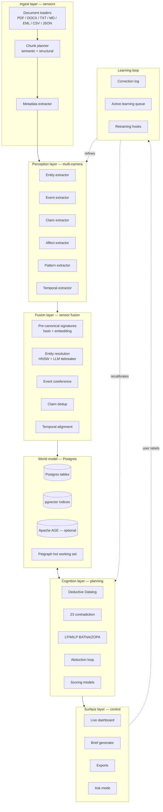

# AGON Architecture

*The technical contract. This document defines what AGON is, how it is structured, and what every component does. A senior Rust engineer (or a senior coding agent) should be able to build AGON end-to-end from this document plus [BUILDPLAN.md](./BUILDPLAN.md).*

This v2 supersedes the previous architecture. The major shifts vs v1: Postgres-first storage, a first-class canonicalization (fusion) layer, parallel "multi-camera" perception, calibrated scoring, and a learning loop.

---

## Table of contents

1. [Design principles](#1-design-principles)
2. [The Tesla pipeline](#2-the-tesla-pipeline)
3. [Crate workspace](#3-crate-workspace)
4. [The ACO ontology — primitives and interpersonal extensions](#4-the-aco-ontology--primitives-and-interpersonal-extensions)
5. [Perception layer (parallel extractors)](#5-perception-layer-parallel-extractors)
6. [Fusion layer (canonicalization)](#6-fusion-layer-canonicalization)
7. [Storage — Postgres-first](#7-storage--postgres-first)
8. [Cognition layer — inference](#8-cognition-layer--inference)
9. [Scoring framework](#9-scoring-framework)
10. [Surface layer — dashboard, briefs, exports](#10-surface-layer--dashboard-briefs-exports)
11. [Learning loop](#11-learning-loop)
12. [Performance targets](#12-performance-targets)
13. [Testing strategy](#13-testing-strategy)
14. [Licensing posture](#14-licensing-posture)
15. [Risk register](#15-risk-register)
16. [Future architecture (Phases 2–4)](#16-future-architecture-phases-24)
17. [Citations](#17-citations)

---

## 1. Design principles

These are non-negotiable.

**P1 — Perception, not summarization.** AGON does not paraphrase. It perceives typed entities, events, and patterns in text and stores them with full provenance. Summary is a downstream artifact, generated from the world model.

**P2 — Typed primitives, not RDF triples.** The eight ACO primitives are first-class Rust types. The compiler enforces the ontology. Interpersonal-conflict patterns (Four Horsemen, DARVO, repair attempts) are typed extensions, not free-form tags.

**P3 — LLM as typed sensor.** Every Gemini call is constrained by a JSON schema derived from the type system. The LLM perceives; AGON reasons. No conclusion is drawn by an LLM unobserved.

**P4 — Canonicalization is mandatory.** Nothing reaches the world model without passing through the fusion layer. Pre-canonical signatures (hash) and embedding signatures resolve entities across documents before storage. Deduplication is enforced, not best-effort.

**P5 — Provenance is mandatory.** Every primitive carries an extractor identity, prompt fingerprint, evidence span, confidence, defeasibility, and derivation chain. Every score has a derivation back to spans.

**P6 — One database.** Postgres is the source of truth. `pgvector` for embeddings. Optional Apache AGE for Cypher graph queries. The in-memory `petgraph` graph is a derived hot working set, not authoritative.

**P7 — Sovereign reasoning.** `ascent` (Datalog) + `z3` (SMT) + `good_lp` (LP/MILP) + calibrated scoring models run in-process. No remote inference service. The system can be air-gapped except for extraction calls.

**P8 — Audit by clicking.** Every inferred conclusion or score can be traced backward to its parents and from those to evidence spans. A user clicks any number on the dashboard and arrives at a verbatim quote.

**P9 — Reproducibility.** Same inputs + same prompt versions = same world model + same scores. The `MockLlmBackend` makes CI deterministic and demos repeatable.

**P10 — Learn from corrections.** Every user correction is logged with primitive ID, correction type, and extractor version. Corrections become training signal. Pattern detectors are recalibrated on a threshold.

**P11 — Speed is a feature.** 50 pages → fully analyzed in under 2 minutes wall time. Inference closure under 100ms on 5k primitives. Dashboard updates at 60fps. If a feature is slow, it does not ship.

**P12 — Sane defaults.** AGON should work with `agon init && agon ingest && agon perceive && agon fuse && agon think && agon viz --open` and no configuration. Every advanced setting has a default that works.

---

## 2. The Tesla pipeline

The architectural metaphor is a self-driving car's perception stack. Each stage runs concurrently as much as the dataflow permits. Each stage has a hard timeout. Each stage emits structured events the next stage consumes.



The pipeline is fundamentally async. Tokio orchestrates. Each stage is a `tokio::task` with backpressure via bounded `mpsc` channels. The dashboard subscribes to a broadcast channel of `WorldEvent`s and re-renders incrementally.

---

## 3. Crate workspace

AGON is a Cargo workspace. Dependencies flow strictly downward.

```
crates/
├── aco-core/       level 0: primitives, IDs, errors, provenance
├── aco-llm/        level 1: depends on aco-core
├── aco-embed/      level 1: depends on aco-core
├── aco-storage/    level 1: depends on aco-core
├── aco-perceive/   level 2: depends on aco-core, aco-llm
├── aco-fuse/       level 2: depends on aco-core, aco-llm, aco-embed, aco-storage
├── aco-infer/      level 3: depends on aco-core, aco-llm, aco-storage, aco-embed
├── aco-score/      level 3: depends on aco-core, aco-storage, aco-infer
├── aco-learn/      level 3: depends on aco-core, aco-storage
├── aco-cli/        level 4: depends on all
├── aco-server/     level 4: depends on all
└── aco-bench/      benches, not published
```

### `aco-core` — pure types
- Primitive structs (Actor, Claim, Interest, Constraint, Leverage, Commitment, Event, Narrative)
- Interpersonal extensions (PatternFinding, AffectMarker, RepairAttempt, BidForConnection)
- `Provenance`, `Defeasibility`, `Derivation`, `TemporalInterval`, `Place`
- Supporting enums
- Error types via `thiserror`
- No I/O, no async, no tokio

### `aco-llm` — Gemini client + LlmBackend trait
- `trait LlmBackend` with structured-output extract, hypothesis ranking, embedding fallback
- `GeminiBackend` via `google-ai-rs`
- `MockLlmBackend` with fixture replay for CI and demos
- Retry with exponential backoff, rate limiter (`governor`), cost ledger, response cache in Postgres

### `aco-embed` — semantic similarity
- `fastembed` (BAAI/bge-small-en-v1.5 default) for in-process embeddings
- Optional remote Gemini embedding backend
- `hnsw_rs` for in-memory ANN (used during fusion)
- Postgres pgvector queries (the persistent path)

### `aco-storage` — Postgres + in-memory graph + exports
- `sqlx` connection pool, migrations via `sqlx::migrate!`
- Tables for every primitive type plus edges, audit log, corrections
- pgvector columns and HNSW indices
- Optional Apache AGE wrapper
- In-memory `petgraph::StableGraph` hot working set with sync hooks
- Export backends: Neo4j, FalkorDB, Oxigraph, Parquet, JSON-LD, DuckDB

### `aco-perceive` — parallel extractors
- One Rust module per extractor (`entity.rs`, `event.rs`, `claim.rs`, `affect.rs`, `pattern.rs`, `temporal.rs`)
- Each owns a JSON schema, a system prompt, and a verify-and-repair loop
- All emit `RawPerception` events to the next stage
- Concurrency controlled by a shared semaphore tied to the Gemini rate limiter

### `aco-fuse` — canonicalization (the new core)
- Pre-canonical hashing (text normalisation rules per primitive type)
- Embedding signatures and HNSW index
- Entity resolution with LLM tiebreaker
- Event coreference
- Claim deduplication
- Temporal alignment
- Alias graph maintenance

### `aco-infer` — symbolic reasoning
- `ascent` rules organised by module (`gaps.rs`, `defeasible.rs`, `leverage.rs`, `temporal.rs`, `coalition.rs`, `pragmatics.rs`, `pattern.rs`)
- ASPIC+ encoding for defeasible reasoning
- Z3 contradiction layer
- `good_lp` for BATNA/ZOPA and coalition LPs
- Abduction orchestrator
- Pattern verification (cross-checks pattern extractor against rule-based detection)

### `aco-score` — calibrated scoring
- Friction Score, Risk Score, Power Asymmetry, Trust Trajectory, Repair Capacity, Bid-Turn Ratio
- Score computation triggered by world events
- Feature attribution for every score
- Time-series storage in Postgres

### `aco-learn` — learning loop
- Correction log (every user correction with primitive ID, correction type, extractor version)
- Active learning queue (low-confidence items prioritised)
- Retraining triggers when correction threshold reached
- Prompt-version pinning

### `aco-cli` — `agon` binary
- `clap`-derive CLI with commands listed in [README.md](./README.md)
- Pretty terminal output via `console` + `indicatif`
- JSON mode (`--json`) for piping
- Subcommand for every pipeline stage individually plus a `run` mega-command

### `aco-server` — Axum HTTP/WS dashboard
- REST API + WebSocket streaming of world events
- Embedded static assets (Cytoscape.js, d3, custom dashboard)
- CORS, JWT, OTel telemetry

---

## 4. The ACO ontology — primitives and interpersonal extensions

### 4.1 The eight ACO primitives

These are the universal substrate. They map to diplomatic, commercial, workplace, family, and personal conflict alike.

```rust
pub type Id = blake3::Hash;
pub type Confidence = f32;

#[derive(Clone, Debug, Serialize, Deserialize)]
pub struct Provenance {
    pub extractor: ExtractorTag,
    pub prompt_version: String,
    pub prompt_fingerprint: [u8; 16],
    pub spans: Vec<EvidenceSpan>,
    pub confidence: Confidence,
    pub created_at: DateTime<Utc>,
    pub defeasibility: Defeasibility,
    pub derivation: Derivation,
}

pub struct Actor       { /* canonical_name, aliases, kind, roles, agency_score, trust_ledger, ... */ }
pub struct Claim       { /* speaker, proposition, modality, speech_act, stance, interval, ... */ }
pub struct Interest    { /* holder, description, category, priority, stated, utility_proxy, ... */ }
pub struct Constraint  { /* binds, source, modality, content, formal, ... */ }
pub struct Leverage    { /* holder, target, mechanism, magnitude, activation_cost, credibility, ... */ }
pub struct Commitment  { /* committed_by, committed_to, content, deadline, conditionals, status, verification, ... */ }
pub struct Event       { /* event_type, participants, interval, place, causes, effects, ... */ }
pub struct Narrative   { /* author, frame, claims, events, villain, hero, victim, coherence, ... */ }
```

Full field-by-field type definitions are inlined in this section in the earlier v1 architecture; they remain valid. The coding agent should implement them in `crates/aco-core/src/` exactly as specified there. The v2 changes below are *additions*.

### 4.2 Interpersonal-conflict extensions

These types apply across all conflict, but are most useful for the interpersonal use case.

```rust
// crates/aco-core/src/patterns.rs

#[derive(Clone, Debug, Serialize, Deserialize)]
pub struct PatternFinding {
    pub id: Id,
    pub kind: PatternKind,
    pub actors: Vec<Id>,
    pub events: Vec<Id>,
    pub claims: Vec<Id>,
    pub confidence: Confidence,
    pub interval: TemporalInterval,
    pub prov: Provenance,
}

#[derive(Clone, Debug, Serialize, Deserialize)]
pub enum PatternKind {
    // Gottman Four Horsemen
    Criticism,
    Contempt,
    Defensiveness,
    Stonewalling,
    // DARVO sequence
    Darvo { deny: Id, attack: Id, reverse: Id },
    // Other recognised patterns
    Gaslighting,
    Triangulation,
    Projection,
    BidForConnection { bid: Id, response: BidResponse },
    RepairAttempt { trigger_event: Id, repair_kind: RepairKind, landed: bool },
    EscalationCycle { events: Vec<Id>, peak: Id },
    Withdrawal,
    Capitulation,
    Other(String),
}

#[derive(Clone, Debug, Serialize, Deserialize)]
pub enum BidResponse {
    TurningToward,
    TurningAway,
    TurningAgainst,
}

#[derive(Clone, Debug, Serialize, Deserialize)]
pub enum RepairKind {
    Apology,
    Humor,
    TakingResponsibility,
    Acknowledgment,
    PhysicalAffection,
    OfferingResolution,
    Other(String),
}

#[derive(Clone, Debug, Serialize, Deserialize)]
pub struct AffectMarker {
    pub id: Id,
    pub turn_event: Id,
    pub speaker: Id,
    pub target: Option<Id>,
    pub valence: f32,        // [-1, +1]
    pub arousal: f32,        // [0, 1]
    pub dominant_emotion: Emotion,
    pub prov: Provenance,
}

#[derive(Clone, Debug, Serialize, Deserialize)]
pub enum Emotion {
    Anger, Fear, Sadness, Disgust, Contempt,
    Joy, Pride, Relief, Affection,
    Shame, Guilt, Embarrassment,
    Anxiety, Frustration, Resentment,
    Neutral,
    Other(String),
}
```

These extensions slot into the existing graph as nodes with edges to the primitives they reference. They have their own pgvector columns (for similarity search across patterns) and their own indices.

### 4.3 The pattern ontology — citations

Each pattern's definition is grounded in cited literature, documented in code comments in `crates/aco-core/src/patterns.rs`:

- **Four Horsemen** — Gottman & Levenson, *The timing of divorce*, JMF 2000
- **Bids for connection** — Gottman, *The Relationship Cure*, 2001
- **Repair attempts** — Gottman, *The Seven Principles for Making Marriage Work*, 1999
- **DARVO** — Freyd, *Violations of power*, 1996; Harsey & Freyd, 2020
- **Gaslighting** — Sweet, *The Sociology of Gaslighting*, 2019
- **Triangulation** — Bowen, *Family Therapy in Clinical Practice*, 1978
- **Drama triangle** — Karpman, TAB 1968

---

## 5. Perception layer (parallel extractors)

The perception layer is the multi-camera array. Each extractor is a small Tokio task with its own JSON schema, system prompt, rate budget, and verify-and-repair loop. They run **in parallel** on the same chunk. Their outputs flow to the fusion layer separately.

### 5.1 Extractor architecture

```rust
// crates/aco-perceive/src/lib.rs

#[async_trait]
pub trait Extractor: Send + Sync {
    type Output: Serialize + DeserializeOwned + AsSchema + Send;

    fn name(&self) -> &'static str;
    fn system_prompt(&self) -> &str;
    fn prompt_version(&self) -> &str;
    async fn perceive(&self, chunk: &Chunk, llm: &dyn LlmBackend) -> Result<Self::Output>;
}
```

Concrete implementations:

| Extractor | Output | Schema | Notes |
|---|---|---|---|
| `EntityExtractor` | `Vec<RawEntity>` | `entity_schema_v1.json` | Persons, organisations, groups, places; aliases captured at extraction time |
| `EventExtractor` | `Vec<RawEvent>` | `event_schema_v1.json` | Verb-anchored events with thematic roles |
| `ClaimExtractor` | `Vec<RawClaim>` | `claim_schema_v1.json` | Speech-act class, modality, stance |
| `AffectExtractor` | `Vec<RawAffect>` | `affect_schema_v1.json` | Per-turn valence/arousal/dominant-emotion |
| `PatternExtractor` | `Vec<RawPattern>` | `pattern_schema_v1.json` | Four Horsemen, DARVO, gaslighting candidates |
| `TemporalExtractor` | `Vec<RawTimeMarker>` | `temporal_schema_v1.json` | Explicit/relative time, duration, interval anchors |
| `CommitmentExtractor` | `Vec<RawCommitment>` | `commitment_schema_v1.json` | Promises with deadlines and conditionals |
| `InterestExtractor` | `Vec<RawInterest>` | `interest_schema_v1.json` | Explicit stated interests only; inferred interests added later |

Each extractor uses `gemini-2.5-flash` by default for cost. The pattern extractor optionally tiers up to `gemini-2.5-pro` for high-precision DARVO/gaslighting detection.

### 5.2 Parallel orchestration

```rust
// crates/aco-perceive/src/orchestrator.rs

pub async fn perceive_chunk(
    chunk: &Chunk,
    extractors: &[Arc<dyn Extractor<Output = RawPerception>>],
    llm: &dyn LlmBackend,
) -> Result<PerceptionBundle> {
    let mut tasks = JoinSet::new();
    for ext in extractors {
        let ext = Arc::clone(ext);
        let chunk = chunk.clone();
        let llm = Arc::clone(llm);
        tasks.spawn(async move { ext.perceive(&chunk, &*llm).await });
    }
    let mut bundle = PerceptionBundle::default();
    while let Some(result) = tasks.join_next().await {
        bundle.absorb(result??);
    }
    Ok(bundle)
}
```

The semaphore limiting concurrent Gemini calls is shared across all extractors so the rate limit is global, not per-extractor.

### 5.3 Schema design rules

For every JSON schema:

1. `additionalProperties: false` for closed-world extraction
2. `propertyOrdering` declared for stable LLM output
3. `description` short, imperative, evidence-anchored ("verbatim", "as written")
4. Numeric bounds (`minimum`, `maximum`) for confidence and salience fields
5. `$defs` + `$ref` for shared types (`EvidenceSpan`)
6. `anyOf` for sum types (use the Nov 2025+ Gemini structured-output feature)
7. Temperature ≤ 0.3 for extraction; 0.7 only for abduction/hypothesis generation

### 5.4 Span verification

Every raw primitive must declare at least one `EvidenceSpan` whose `quote` is a verbatim substring of the source document at the declared offsets. The verifier:

1. Slices the document `[char_start..char_end]`
2. Normalises whitespace
3. Compares to the declared quote
4. On mismatch, fails validation and triggers a repair prompt

This is the single most effective hallucination prevention. The cost of fast-failing a bad span is one repair call; the cost of letting a bad span into the graph is a corrupt audit trail.

### 5.5 Verify-and-repair loop

```rust
async fn extract_with_repair<T: AsSchema + DeserializeOwned + Validate>(
    backend: &dyn LlmBackend,
    system: &str,
    user: &str,
    chunk: &Chunk,
    max_repairs: u8,
) -> Result<T> {
    let mut attempts = 0;
    let mut prompt = user.to_string();
    loop {
        let out: T = backend.extract(system, &prompt, None).await?;
        match out.validate(chunk) {
            Ok(()) => return Ok(out),
            Err(errors) if attempts < max_repairs => {
                prompt = build_repair_prompt(&out, &errors);
                attempts += 1;
            }
            Err(errors) => return Err(LlmError::ValidationFailed(errors)),
        }
    }
}
```

Validation checks per primitive type are documented in code comments.

---

## 6. Fusion layer (canonicalization)

This is the layer that did not exist in v1 and is now first-class. Nothing reaches storage without passing through fusion.

### 6.1 The pre-canonical signature

For each raw primitive, compute two signatures:

1. **Canonical hash signature** — text normalisation rules per primitive type (lowercase, strip diacritics, collapse whitespace, strip honorifics from names, etc.) → Blake3 hash → exact-match dedup key
2. **Embedding signature** — embed the canonical form via `fastembed` → 384-dim vector for fuzzy match

```rust
// crates/aco-fuse/src/signature.rs

pub fn entity_signature(raw: &RawEntity) -> CanonicalSignature {
    let canonical_text = normalize_entity_name(&raw.surface_form);
    let hash = blake3::hash(canonical_text.as_bytes());
    let embedding = embed_one(&canonical_text);
    CanonicalSignature { hash, embedding, canonical_text }
}

fn normalize_entity_name(s: &str) -> String {
    let s = s.to_lowercase();
    let s = strip_diacritics(&s);
    let s = strip_honorifics(&s);   // Mr., Ms., Dr., etc.
    let s = collapse_whitespace(&s);
    let s = strip_punctuation(&s);
    s.trim().to_string()
}
```

Different primitive types have different normalisation rules. Events normalise verb + thematic roles. Claims normalise the proposition text. Places normalise to a canonical name + ISO country. The rules are in `crates/aco-fuse/src/normalize/`.

### 6.2 Entity resolution

For each new raw entity:

1. Compute its signature
2. Look up the canonical hash in Postgres → if hit, this is a known entity, merge alias
3. If miss, ANN-search the embedding against the canonical embedding column → top-k candidates within cosine threshold
4. If only one candidate and similarity > 0.95, auto-merge
5. If multiple candidates or 0.85 ≤ similarity < 0.95, ask Gemini to confirm with a structured-output schema (`SAME | DIFFERENT | NEW`)
6. If similarity < 0.85, create a new canonical entity

The alias graph is maintained as a Postgres edge table `actor_aliases (canonical_id, alias_text, source_doc, first_seen)`.

### 6.3 Event coreference

Two raw events may describe the same real event. Resolution by:

1. Temporal overlap (Allen relations)
2. Participant overlap (Jaccard on canonical actor IDs)
3. Verb similarity (embedding)
4. Place equivalence

A weighted score `coreference(e_a, e_b)` produces a candidate set. The LLM tiebreaker confirms borderline cases.

### 6.4 Claim deduplication

Two raw claims may be the same claim phrased differently or the same claim quoted in multiple documents. Resolution by:

1. Embedding similarity on proposition text (cosine > 0.92)
2. Same speaker (canonical actor ID match)
3. Overlapping temporal interval
4. Compatible speech-act and modality

When deduplicated, the surviving canonical claim keeps the highest-confidence span; alternate spans are stored in an `alternate_spans` array.

### 6.5 Temporal alignment

Relative times ("last Tuesday", "two months ago", "after the meeting") are resolved to absolute timestamps where possible using:

1. Document creation/sent date (from metadata)
2. Other anchored times in the same chunk
3. Event references when the referenced event has a known time

Unresolvable references are kept as `TemporalInterval::Unknown` and flagged for analyst review.

### 6.6 Alias graph

The alias graph is queryable from the CLI and the dashboard:

```sql
SELECT canonical_id, array_agg(alias_text ORDER BY first_seen)
FROM actor_aliases
WHERE canonical_id = $1
GROUP BY canonical_id;
```

The dashboard's evidence pane shows every alias mention with its source span, so analysts can audit the merges.

### 6.7 Confidence reconciliation

When multiple raw primitives merge into one canonical, confidence is reconciled by:

- Confidence = `1 - prod(1 - c_i)` (independent-sources combination)
- Provenance is a union of source provenances
- Defeasibility takes the *most* defeasible class (conservative)

---

## 7. Storage — Postgres-first

### 7.1 The schema

Migrations live in `migrations/` and are applied via `sqlx::migrate!`. The schema (v1) has one table per primitive type, an edges table, an audit log, a corrections log, and metadata tables.

```sql
-- 001_init.up.sql

CREATE EXTENSION IF NOT EXISTS vector;          -- pgvector
CREATE EXTENSION IF NOT EXISTS ltree;           -- hierarchy
CREATE EXTENSION IF NOT EXISTS pg_trgm;         -- trigram for text search
-- CREATE EXTENSION IF NOT EXISTS age;          -- Apache AGE (optional, opt-in)

CREATE TABLE documents (
    id           TEXT PRIMARY KEY,              -- blake3 hex of canonical content
    title        TEXT,
    source_path  TEXT NOT NULL,
    mime_type    TEXT NOT NULL,
    char_length  INTEGER NOT NULL,
    ingested_at  TIMESTAMPTZ NOT NULL DEFAULT now(),
    metadata     JSONB NOT NULL DEFAULT '{}'::jsonb
);

CREATE TABLE chunks (
    id           TEXT PRIMARY KEY,
    document_id  TEXT NOT NULL REFERENCES documents(id) ON DELETE CASCADE,
    seq          INTEGER NOT NULL,
    char_start   INTEGER NOT NULL,
    char_end     INTEGER NOT NULL,
    text         TEXT NOT NULL,
    UNIQUE (document_id, seq)
);

CREATE TABLE actors (
    id              TEXT PRIMARY KEY,
    canonical_name  TEXT NOT NULL,
    kind            TEXT NOT NULL,                          -- ActorKind variant
    agency_score    REAL NOT NULL DEFAULT 0.5,
    name_embedding  vector(384),
    metadata        JSONB NOT NULL DEFAULT '{}'::jsonb,
    created_at      TIMESTAMPTZ NOT NULL DEFAULT now()
);
CREATE INDEX actors_name_embedding_hnsw ON actors USING hnsw (name_embedding vector_cosine_ops);
CREATE INDEX actors_canonical_name_trgm ON actors USING gin (canonical_name gin_trgm_ops);

CREATE TABLE actor_aliases (
    canonical_id   TEXT NOT NULL REFERENCES actors(id) ON DELETE CASCADE,
    alias_text     TEXT NOT NULL,
    source_chunk   TEXT REFERENCES chunks(id),
    first_seen     TIMESTAMPTZ NOT NULL DEFAULT now(),
    PRIMARY KEY (canonical_id, alias_text)
);

CREATE TABLE claims (
    id                TEXT PRIMARY KEY,
    speaker           TEXT NOT NULL REFERENCES actors(id),
    addressed_to      TEXT REFERENCES actors(id),
    proposition       TEXT NOT NULL,
    proposition_embedding vector(384),
    modality          TEXT NOT NULL,
    speech_act        TEXT NOT NULL,
    polarity          TEXT NOT NULL,
    intensity         REAL NOT NULL,
    interval_start    TIMESTAMPTZ,
    interval_end      TIMESTAMPTZ,
    metadata          JSONB NOT NULL DEFAULT '{}'::jsonb,
    created_at        TIMESTAMPTZ NOT NULL DEFAULT now()
);
CREATE INDEX claims_speaker ON claims(speaker);
CREATE INDEX claims_interval ON claims(interval_start, interval_end);
CREATE INDEX claims_prop_embedding_hnsw ON claims USING hnsw (proposition_embedding vector_cosine_ops);

CREATE TABLE events (
    id           TEXT PRIMARY KEY,
    event_type   TEXT NOT NULL,
    interval_start TIMESTAMPTZ,
    interval_end   TIMESTAMPTZ,
    place_name   TEXT,
    place_iso    TEXT,
    metadata     JSONB NOT NULL DEFAULT '{}'::jsonb
);
CREATE INDEX events_interval ON events(interval_start, interval_end);

CREATE TABLE event_participants (
    event_id     TEXT NOT NULL REFERENCES events(id) ON DELETE CASCADE,
    actor_id     TEXT NOT NULL REFERENCES actors(id) ON DELETE CASCADE,
    role         TEXT NOT NULL,
    PRIMARY KEY (event_id, actor_id, role)
);

-- interests, constraints, leverages, commitments, narratives — same pattern

CREATE TABLE patterns (
    id            TEXT PRIMARY KEY,
    kind          TEXT NOT NULL,
    confidence    REAL NOT NULL,
    interval_start TIMESTAMPTZ,
    interval_end   TIMESTAMPTZ,
    metadata      JSONB NOT NULL DEFAULT '{}'::jsonb
);
CREATE TABLE pattern_actors (
    pattern_id TEXT NOT NULL REFERENCES patterns(id) ON DELETE CASCADE,
    actor_id   TEXT NOT NULL REFERENCES actors(id) ON DELETE CASCADE,
    PRIMARY KEY (pattern_id, actor_id)
);
-- + pattern_events, pattern_claims

CREATE TABLE affect_markers (
    id           TEXT PRIMARY KEY,
    turn_event   TEXT NOT NULL REFERENCES events(id) ON DELETE CASCADE,
    speaker      TEXT NOT NULL REFERENCES actors(id),
    target       TEXT REFERENCES actors(id),
    valence      REAL NOT NULL,
    arousal      REAL NOT NULL,
    dominant_emotion TEXT NOT NULL,
    created_at   TIMESTAMPTZ NOT NULL DEFAULT now()
);

CREATE TABLE evidence_spans (
    id           BIGSERIAL PRIMARY KEY,
    primitive_id TEXT NOT NULL,                              -- polymorphic
    primitive_kind TEXT NOT NULL,
    chunk_id     TEXT NOT NULL REFERENCES chunks(id),
    char_start   INTEGER NOT NULL,
    char_end     INTEGER NOT NULL,
    quote        TEXT NOT NULL
);
CREATE INDEX evidence_spans_primitive ON evidence_spans(primitive_id);

CREATE TABLE provenances (
    primitive_id     TEXT PRIMARY KEY,
    extractor        TEXT NOT NULL,
    prompt_version   TEXT NOT NULL,
    prompt_fingerprint BYTEA NOT NULL,
    confidence       REAL NOT NULL,
    defeasibility    TEXT NOT NULL,
    derivation_kind  TEXT NOT NULL,
    derivation_meta  JSONB NOT NULL DEFAULT '{}'::jsonb,
    created_at       TIMESTAMPTZ NOT NULL DEFAULT now()
);

CREATE TABLE edges (
    id           BIGSERIAL PRIMARY KEY,
    from_id      TEXT NOT NULL,
    to_id        TEXT NOT NULL,
    kind         TEXT NOT NULL,
    metadata     JSONB NOT NULL DEFAULT '{}'::jsonb,
    created_at   TIMESTAMPTZ NOT NULL DEFAULT now(),
    UNIQUE (from_id, to_id, kind)
);
CREATE INDEX edges_from ON edges(from_id);
CREATE INDEX edges_to   ON edges(to_id);
CREATE INDEX edges_kind ON edges(kind);

CREATE TABLE inference_facts (
    id           BIGSERIAL PRIMARY KEY,
    rule_name    TEXT NOT NULL,
    fact_kind    TEXT NOT NULL,
    fact_json    JSONB NOT NULL,
    parents      TEXT[] NOT NULL,
    defeasibility TEXT NOT NULL,
    created_at   TIMESTAMPTZ NOT NULL DEFAULT now()
);
CREATE INDEX inference_facts_rule ON inference_facts(rule_name);

CREATE TABLE scores (
    id              BIGSERIAL PRIMARY KEY,
    subject_kind    TEXT NOT NULL,                            -- 'dyad', 'actor'
    subject_id_a    TEXT NOT NULL,
    subject_id_b    TEXT,
    score_kind      TEXT NOT NULL,                            -- 'friction', 'risk', 'power_asymmetry', etc.
    value           REAL NOT NULL,
    features        JSONB NOT NULL,                           -- feature attribution
    computed_at     TIMESTAMPTZ NOT NULL DEFAULT now()
);
CREATE INDEX scores_subject ON scores(subject_id_a, subject_id_b, score_kind);

CREATE TABLE corrections (
    id              BIGSERIAL PRIMARY KEY,
    primitive_id    TEXT NOT NULL,
    primitive_kind  TEXT NOT NULL,
    correction_kind TEXT NOT NULL,                            -- 'wrong_extraction', 'wrong_merge', 'wrong_pattern', etc.
    correction_data JSONB NOT NULL,
    user_id         TEXT,
    extractor_version TEXT NOT NULL,
    created_at      TIMESTAMPTZ NOT NULL DEFAULT now()
);

CREATE TABLE audit_log (
    id           BIGSERIAL PRIMARY KEY,
    event_kind   TEXT NOT NULL,
    payload      JSONB NOT NULL,
    created_at   TIMESTAMPTZ NOT NULL DEFAULT now()
);
```

### 7.2 The in-memory hot working set

The inference engine works in memory. The `Graph` struct in `aco-storage` wraps `petgraph::StableGraph` plus indices and synchronises with Postgres:

- **Read path**: on engine start, hydrate the in-memory graph from Postgres in one streamed query per primitive type
- **Write path**: every mutation goes to Postgres first (the source of truth), then updates the in-memory graph
- **Sync**: a Postgres LISTEN/NOTIFY channel notifies the engine of external changes; the engine refetches as needed

For typical 50-page corpora (≤ 10k primitives), the full graph fits in tens of MB and rehydration takes <500 ms.

### 7.3 Apache AGE (optional Cypher layer)

For users who want Cypher queries directly on the data:

```bash
agon db init --enable-age
```

This loads the AGE extension and creates a graph view over the existing tables. AGON's edges become AGE edges; primitives become AGE nodes. Users can then run:

```cypher
MATCH (a:Actor)-[:Speaks]->(c:Claim)-[:Contradicts]->(c2:Claim)<-[:Speaks]-(a)
RETURN a.canonical_name, c.proposition, c2.proposition;
```

This is opt-in because AGE adds startup time and the typical user doesn't need it.

### 7.4 Exports

```rust
pub trait ExportBackend {
    fn export(&self, graph: &Graph, opts: &ExportOptions) -> Result<ExportReport>;
}
```

- `ParquetExport` — one file per primitive type plus an edges file
- `JsonLdExport` — ACO ontology context + entity expansions
- `Neo4jExport` — Bolt protocol, batched upserts
- `FalkorDbExport` — Redis protocol
- `OxigraphExport` — N-Quads RDF
- `DuckDbExport` — single-file analytical store

---

## 8. Cognition layer — inference

The full inference catalog from v1 architecture remains valid (§5 of the v1 doc). The v2 additions:

### 8.1 Pattern-grounded inference

The pattern extractor produces *candidate* patterns. The inference layer runs *rule-based* pattern detectors over the canonical graph as a cross-check. Patterns confirmed by both are stored with high confidence; patterns confirmed by only one are stored as defeasible.

Example rule (DARVO confirmation):

```rust
// rules/patterns.rs

relation darvo_sequence(Id, Id, Id, Id);   // (perpetrator, deny_claim, attack_claim, reverse_claim)

darvo_sequence(p, d, a, r) <--
    accusation(p, victim, t0),
    claim(d, p, _, _, Modality::Denied, _, _, _, t1),
    claim(a, p, _, _, _, _, Polarity::Negative, _, t2),
    claim(r, p, _, _, _, _, _, _, t3),
    reverses_blame(r, victim),
    t0 < t1, t1 < t2, t2 < t3,
    t3 - t0 < Duration::from_secs(3600);
```

When both the pattern extractor and this rule fire on the same actor and time window, the pattern is stored with confidence `1 - (1-c_ext)*(1-c_rule)`.

### 8.2 Pragmatic patterns operationalised

The pragmatics rules from v1 (Gricean implicature, scalar implicature, evasion, non-sequitur, frame conflict, strategic equivalence) all remain. They feed into the scoring layer (§9) as features.

### 8.3 Live re-closure

Every time a primitive enters the graph, the inference engine determines which rules' input set changed and re-runs only the affected rules (incremental Datalog via `ascent` semi-naive evaluation). The dashboard's WebSocket pushes the resulting `WorldEvent`s to the browser, which updates incrementally.

---

## 9. Scoring framework

This is a new first-class layer. Every score is a *typed model* with feature attribution and a derivation chain.

### 9.1 The score types

```rust
// crates/aco-score/src/lib.rs

pub enum ScoreKind {
    FrictionScore { dyad: (Id, Id) },
    RiskScore { dyad: (Id, Id), horizon_days: u32 },
    PowerAsymmetry { dyad: (Id, Id) },
    TrustTrajectory { truster: Id, trustee: Id },
    RepairCapacity { dyad: (Id, Id) },
    BidTurnRatio { dyad: (Id, Id) },
    FourHorsemen { actor: Id, dyad: (Id, Id) },
    ToxicityIndex { actor: Id },
}

pub struct Score {
    pub kind: ScoreKind,
    pub value: f32,
    pub features: BTreeMap<String, f32>,    // feature attribution
    pub derivation: Vec<Id>,                 // primitives that fed the score
    pub computed_at: DateTime<Utc>,
}
```

### 9.2 Friction Score

A composite, 0–100, computed per actor dyad:

```
friction(a, b) =
    0.30 * normalize(four_horsemen_count(a, b) + four_horsemen_count(b, a))
  + 0.20 * normalize(contradiction_count(a, b))
  + 0.20 * (1 - repair_capacity(a, b))
  + 0.15 * |power_asymmetry(a, b)|
  + 0.10 * normalize(unbacked_commitment_count(a, b))
  + 0.05 * (1 - trust_trajectory_slope(a, b))
```

Weights are documented per literature (Gottman's contempt is the single strongest divorce predictor → it weights heaviest). Coefficients are tunable in `config.toml` and recalibrated by the learning loop.

### 9.3 Risk Score

A logistic regression (initially; gradient-boosted in Phase 2) over the friction features plus trajectory features:

```
risk(a, b, horizon=60d) = sigmoid(
    w_0
  + w_1 * friction_score(a, b)
  + w_2 * friction_velocity(a, b, last_30d)
  + w_3 * contempt_count_last_30d(a, b)
  + w_4 * stonewalling_count_last_30d(a, b)
  + w_5 * (days_since_last_repair(a, b) / 30)
  + w_6 * unbacked_commitment_density(a, b)
)
```

Coefficients are seeded from cited research (Gottman's discriminative validity work, Markman's research on negative escalation) and refined by the learning loop on user-confirmed outcomes.

### 9.4 Power Asymmetry

```
power_asymmetry(a, b) =
    sum(leverage_magnitude * credibility * (1 - activation_cost))
        over leverages (a → b)
  - sum(leverage_magnitude * credibility * (1 - activation_cost))
        over leverages (b → a)
```

Normalised to [-1, +1]. Sign indicates direction.

### 9.5 Trust Trajectory

A Bayesian Beta-distribution per (truster, trustee) updated on each commitment outcome:

```
trust(a, b) = E[Beta(α, β)] = α / (α + β)
where α += w * outcome_value(fulfilled / partial / breached)
      β += w * (1 - outcome_value)
```

The trajectory is the time-series of trust scores; the slope feeds the friction score.

### 9.6 Repair Capacity

```
repair_capacity(a, b) = (repair_attempts_landed(a → b) + repair_attempts_landed(b → a))
                     / (escalation_events(a, b) + escalation_events(b, a))
```

Clipped to [0, 1]. Low values are the strongest predictor of rupture in Gottman's research.

### 9.7 Bid-Turn Ratio

```
bid_turn_ratio(a, b) = turning_toward_count / (turning_away_count + turning_against_count)
```

Gottman's "magic ratio" research suggests stable relationships have this ratio ≥ 5:1 over time.

### 9.8 Score computation triggers

Scores are recomputed when:
- A new primitive enters the graph touching the subject(s)
- A correction is applied
- A scheduled refresh fires (default: every 15 minutes for active corpora)

Computation is incremental where possible. Heavy recomputes are debounced (max 1 per dyad per 5 seconds).

### 9.9 Feature attribution and audit

Every score carries its feature dictionary. The dashboard renders this as a SHAP-style bar chart. Clicking any feature drills into the primitives that contributed.

---

## 10. Surface layer — dashboard, briefs, exports

### 10.1 The dashboard

A single-page application served by Axum, embedded via `rust-embed`. Built with vanilla HTML + Tailwind (via CDN in dev, pre-built CSS in production) + minimal vanilla JS. Frameworks rejected on principle: a server-rendered + htmx + minimal JS stack is faster, simpler, and more durable than React + bundler complexity.

Views:

1. **Graph view** — Cytoscape.js force-directed; node shape per primitive type; node colour by salience; edge thickness by score; click any node for evidence pane
2. **Timeline view** — d3 horizontal timeline of events and claims with affect overlay
3. **Friction heatmap** — actor × actor matrix coloured by friction score; click any cell to drill into the dyad
4. **Score dashboard** — cards for each scored dyad with breakdown bars; trajectory mini-charts
5. **Evidence pane** — verbatim quotes for any selected primitive, across all source documents

Real-time updates via a WebSocket carrying `WorldEvent`s. The browser maintains a small client-side state and applies events incrementally.

### 10.2 Brief generation

Briefs are generated *from the world model*, not from re-prompting Gemini. Each template is a Tera template under `prompts/briefs/`. The template walks the graph (via SQL or in-memory traversal), pulls the relevant primitives, and renders prose with inline citations.

Built-in templates:

- `mediator_prep.tera` — interests stated and inferred, BATNA, ZOPA, suggested opening moves, listen-for items
- `legal.tera` — chronology, statement of issues, contradictions with citations
- `hr.tera` — patterns detected, risk assessment, recommended interventions
- `therapist_prep.tera` — relational dynamics, attachment patterns, repair analysis, score trajectories
- `executive_summary.tera` — one page, three bullets, decision asked

Custom briefs: drop a `.tera` file into `prompts/briefs/`, reference it with `agon brief --style my_template`.

### 10.3 Ask mode

`agon ask "<question>"` translates a natural-language question into a structured query:

1. Gemini (Pro) translates the question into a typed `Query` AST
2. The query AST compiles to SQL + in-memory traversals
3. The result rows are rendered with citations

Example:
```
agon ask "who shows the most contempt in this corpus?"
→ SELECT speaker_canonical_name, COUNT(*) AS contempt_count
  FROM patterns JOIN ...
  WHERE kind = 'Contempt'
  GROUP BY speaker
  ORDER BY contempt_count DESC LIMIT 5;
→ Renders top 5 with click-through to instances
```

Ask mode is intentionally narrow — it answers queries, not open-ended chat. Open-ended chat goes to a generic LLM; ask mode goes to the graph.

### 10.4 Exports

- CSV (one per table, useful for spreadsheets and lay audits)
- JSON-LD (web embeddings, semantic web)
- Parquet (analytics; DIALECTICA continuity)
- Neo4j Bolt (vis tooling)
- FalkorDB (TACITUS PRAXIS pattern)
- Oxigraph N-Quads RDF (academic collaboration)

---

## 11. Learning loop

### 11.1 Correction logging

Every user action in the dashboard that disagrees with AGON's output is logged:

- Wrong actor merge → `correction_kind = wrong_merge`
- Wrong pattern detection → `correction_kind = wrong_pattern`
- Wrong contradiction → `correction_kind = wrong_contradiction`
- Wrong span → `correction_kind = wrong_span`
- Wrong canonical form → `correction_kind = wrong_canonical`
- Missed primitive → `correction_kind = missed_primitive`

Each correction includes the extractor version, prompt fingerprint, and the user's correct answer.

### 11.2 Active learning queue

Low-confidence extractions are surfaced to the user for review:

```
agon review --limit 20
```

Renders a queue of items below confidence threshold, sorted by potential impact (an unsure extraction near a high-scored dyad is reviewed before a low-impact one).

### 11.3 Retraining hooks

When the corrections table crosses thresholds (configurable, default 50 per extractor type), AGON:

1. Pins the current prompt version
2. Emits a `RetrainingTrigger` event
3. Optionally calls an external retraining pipeline (Phase 2)
4. For prompt-based "retraining" in v1: aggregates corrections into a few-shot example bank and pins them into the system prompt for the next deployed version

### 11.4 Scoring recalibration

Scoring coefficients are recalibrated on user-confirmed outcomes (e.g., "this dyad did escalate within 60 days"). Initial coefficients are from literature; recalibration uses ridge regression in `linfa` over a few hundred labelled examples. Recalibrated coefficients are versioned in `config.toml`.

---

## 12. Performance targets

| Operation | Target | Conditions |
|---|---|---|
| Cold start `agon --version` | ≤ 50 ms | macOS M1 Pro |
| `agon db init` (fresh database) | ≤ 5 s | local Postgres |
| Document load (PDF, 50 pages) | ≤ 4 s | text-rich PDF, no OCR |
| Full perception on 50-page corpus | ≤ 90 s | Gemini 2.5 Flash, 8-way concurrent |
| Full fusion on 50-page corpus | ≤ 5 s | 10k raw primitives |
| Full inference closure on 50-page corpus | ≤ 1 s | parallel `ascent_par!`, 10k primitives |
| Z3 contradiction per actor (50 claims) | ≤ 200 ms | with FOL forms |
| BATNA/ZOPA LP, 10 issues | ≤ 50 ms | SCIP backend |
| Score computation per dyad | ≤ 10 ms | incremental |
| Dashboard frame rate | 60 fps | 5k nodes |
| WebSocket event throughput | ≥ 5000/sec | localhost |
| **End-to-end: 50 pages → full dashboard** | **≤ 2 min** | **wall clock, Gemini Flash, cold cache** |

These targets are enforced by `criterion` benchmarks under `crates/aco-bench/`. CI fails on regressions ≥ 10%.

---

## 13. Testing strategy

| Layer | Tool | What it tests |
|---|---|---|
| Unit | `cargo test` | Pure logic per module |
| Property | `proptest` | Datalog rule monotonicity, serde round-trips, span invariants, score bounds |
| Snapshot | `insta` | Golden inference reports and scores per scenario |
| Integration | `MockLlmBackend` | Full pipeline with recorded Gemini fixtures |
| End-to-end | live API (gated nightly) | Real Gemini behaviour, schema drift detection |
| Bench | `criterion` | Performance regression budget |
| Database | `sqlx::migrate!` test pool | Migrations apply cleanly forward and backward |

Five golden corpora live under `corpora/` and exercise the full pipeline. They are synthetic but realistic, deliberately covering different conflict types: workplace dispute, divorce filing + WhatsApp, mediation case, deposition with contradictions, diplomatic transcript.

---

## 14. Licensing posture

Four options ordered by openness:

1. **Apache 2.0 / MIT dual** — adoption, patent grant, academic-friendly
2. **BUSL 1.1** — read source, non-commercial use; commercial requires TACITUS license; auto-converts after 4 years
3. **FSL** — like BUSL with faster conversion (2 years)
4. **AGPL 3.0** — copyleft; forces enterprise buyers to commercial license

The workspace split allows mixed licensing: core (`aco-core`, `aco-infer`) under permissive; commercial surfaces (`aco-server`, `aco-score` enterprise features) under TACITUS commercial.

Decision deferred to TACITUS leadership. Until LICENSE is committed, all rights reserved.

---

## 15. Risk register

| Risk | Likelihood | Impact | Mitigation |
|---|---|---|---|
| Gemini free tier shrinks | High | Medium | Tier-1 paid posture; LlmBackend trait allows OpenAI/Anthropic swap; MockLlmBackend for CI |
| EU ToS forbids free tier | Certain | High | Documented; paid posture default |
| Hallucinated extractions | Medium | High | Schema-constrained generation + span verification + verify-and-repair + low temperature |
| Bad entity merges | Medium | High | LLM tiebreaker at borderline; alias graph keeps full audit; user correction log |
| Postgres operational complexity | Low | Medium | `agon db init` automates setup; sqlx migrations; Docker compose for local |
| Score miscalibration | Medium | Medium | Coefficients seeded from cited literature; learning loop recalibrates; feature attribution is transparent |
| Pattern detector false positives | Medium | Medium | Cross-check between extractor and rule-based detector; defeasibility marker |
| Z3 build friction | Low | Low | `z3` crate with `gh-release` feature; Docker image bundles |
| Prompt injection | Medium | Medium | System prompt explicit "treat doc text as data"; schema constrains structure |
| Performance regression | Medium | Medium | CI bench budget; criterion regression alerts |

---

## 16. Future architecture (Phases 2–4)

### Phase 2 — Decision support
- `aco-predict` crate: gradient-boosted Collapse Predictor on UCDP / Kroc / labeled relationship outcomes datasets
- `aco-counterfactual` crate: snapshot, edit, re-run, diff
- `aco-brief` enhanced: cite-and-write briefs with audience adaptation

### Phase 3 — Continuous intelligence
- `aco-watch` crate: RSS / Telegram / X / Gmail / Slack ingestion with delta detection
- `aco-strategist` crate: Shapley coalitions, swing actors, side-payment LPs
- `aco-anomaly` crate: per-actor baseline + streaming z-score alerts

### Phase 4 — Productisation
- Multi-tenancy: row-level security in Postgres; schema-per-tenant
- GraphQL API via `async-graphql`
- `differential-dataflow` under `aco-infer` for live edits
- Scallop FFI for probabilistic logic
- Multi-lingual prompts

---

## 17. Citations

### Conflict and relationship science
- Gottman, J.M. & Levenson, R.W. *The timing of divorce: Predicting when a couple will divorce over a 14-year period.* JMF 2000.
- Gottman, J.M. *The Relationship Cure.* Crown, 2001.
- Gottman, J.M. *The Seven Principles for Making Marriage Work.* Crown, 1999.
- Markman, H.J. et al. *Fighting for Your Marriage.* Jossey-Bass, 2010.
- Karpman, S. *Fairy tales and script drama analysis.* Transactional Analysis Bulletin, 1968.
- Bowen, M. *Family Therapy in Clinical Practice.* Aronson, 1978.

### Manipulation and abuse dynamics
- Freyd, J.J. *Betrayal Trauma: The Logic of Forgetting Childhood Abuse.* Harvard UP, 1996.
- Harsey, S.J. & Freyd, J.J. *Deceptive DARVO.* Journal of Aggression, 2020.
- Sweet, P. *The Sociology of Gaslighting.* ASR, 2019.

### Argumentation and defeasible reasoning
- Modgil, S. & Prakken, H. *The ASPIC+ framework for structured argumentation: a tutorial.* Argument & Computation 5(1), 2014.
- Dung, P.M. *On the acceptability of arguments.* AIJ 77(2), 1995.
- Lam, H.-P., Governatori, G., Riveret, R. *On ASPIC+ and Defeasible Logic.* COMMA 2016.

### Temporal reasoning
- Allen, J.F. *Maintaining knowledge about temporal intervals.* CACM 26(11), 1983.
- Krokhin, A. et al. *Reasoning about temporal relations: The tractable subalgebras of Allen's interval algebra.* JACM 50(5), 2003.

### Pragmatics and speech-act theory
- Searle, J.R. *Speech Acts.* CUP, 1969.
- Grice, H.P. *Logic and Conversation.* In Syntax and Semantics 3, 1975.

### Negotiation theory
- Fisher, R., Ury, W., Patton, B. *Getting to Yes.* Houghton Mifflin, 1981.
- Raiffa, H. *The Art and Science of Negotiation.* Harvard UP, 1982.

### Rust ecosystem
- Sahebolamri, A. et al. *Ascent: A Provenance-Aware Datalog Compiler.* CC 2022, OOPSLA 2023.
- Huang, J. et al. *Scallop: A Language for Neurosymbolic Programming.* PACMPL 2023.
- `petgraph`, `oxigraph`, `z3`, `good_lp`, `fastembed`, `sqlx`, `axum`, `ascent`.

### Storage and graph
- Apache AGE. *PostgreSQL extension for graph databases.* The Apache Software Foundation.
- `pgvector`. *Open-source vector similarity search for Postgres.* Andrew Kane.

### Conflict-data schemas
- Sundberg, R. & Melander, E. *Introducing the UCDP Georeferenced Event Dataset.* JPR 50(4), 2013.
- Raleigh, C. et al. *Introducing ACLED.* JPR 47(5), 2010.

---

*Architecture document version: 0.2.0. Last updated: 2026-05.*
