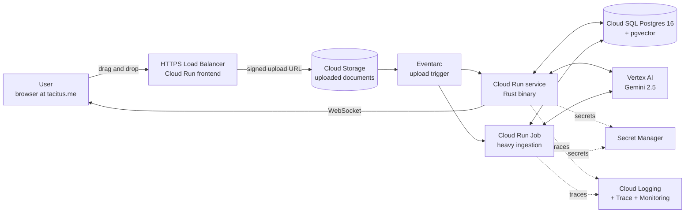

<div align="center">

# AGON

**A Tesla-style perception engine for human conflict. Built in Rust. Deployed natively to Google Cloud.**

*Drop fifty pages of real text — messages, transcripts, complaints, depositions, journals — and AGON drives through it like a self-driving car drives through a street. It sees people, events, claims, frictions, patterns. It deduplicates everything. It scores relationships. It tells you where the conflict is, who has leverage, what's escalating, and what's about to break. Every conclusion traces back to a verbatim quote.*

*GitHub → Cloud Build → Cloud Run. No local Postgres, no laptop runtime. Push to main, the cloud deploys.*

[](https://tacitus.me)
[](https://www.rust-lang.org)
[](https://cloud.google.com/run)
[](https://cloud.google.com/sql)
[](https://cloud.google.com/vertex-ai)

</div>

---

## The use case in one paragraph

You have a folder. Inside it: a 50-page divorce filing, three years of WhatsApp messages between two co-parents, a 12-page HR complaint, two depositions, a mediator's notes, a journal. You drag it onto the AGON web dashboard. Within five minutes you have, served from your Cloud Run instance:

- A canonical list of every person involved, deduplicated across all documents
- A timeline of every event mentioned, fused across sources
- A friction score for every relationship dyad
- A risk score for escalation, with the specific signals driving it
- The Four Horsemen count per person (Gottman: criticism, contempt, defensiveness, stonewalling)
- The unbacked commitments, the contradictions across time, the leverage imbalance
- A live, clickable visualization where every node traces back to the verbatim quote that grounds it
- An exportable brief in the format you need (legal, mediator-prep, HR, therapist-prep)

That is what AGON does. It runs entirely on Google Cloud. You never run Rust on your laptop.

---

## How it works — the Tesla pipeline, deployed

A Tesla doesn't read the road. It *perceives* it — eight cameras feeding parallel networks, then a fusion layer that turns those streams into a single coherent world model, then planning, then control. Each layer is fast, the layers run concurrently, the system learns from every mile driven.

AGON is the same shape, applied to text, running on GCP services.



The Rust binary builds in Cloud Build, ships to Artifact Registry, deploys to Cloud Run. Documents upload directly to Cloud Storage via signed URLs (so the Cloud Run service is never a file-upload bottleneck). Eventarc triggers ingestion when files land. Heavy ingestion uses Cloud Run Jobs; light interactive queries hit the Cloud Run service. Postgres on Cloud SQL is the source of truth. Vertex AI Gemini is the LLM backend (no API keys — service-account auth). The dashboard is served by the same Rust binary and updates over WebSocket.

| Tesla layer | AGON layer | GCP service |
|---|---|---|
| Cameras | Document loaders | Cloud Storage (signed URL uploads) |
| Object detection | Parallel extractors | Cloud Run + Vertex AI Gemini |
| Sensor fusion | Canonicalization | Cloud Run |
| HD map | World model | Cloud SQL for Postgres + pgvector |
| Path planning | Inference + scoring | Cloud Run |
| Control output | Dashboard + briefs | Cloud Run + WebSocket |
| Fleet learning | Correction loop | Cloud SQL + Cloud Run Jobs |
| Telemetry | Observability | Cloud Logging + Trace + Monitoring |
| Pipeline | CI/CD | Cloud Build + Artifact Registry |
| Secrets | API keys, DB creds | Secret Manager + IAM service accounts |

---

## What you get out — concrete

For a folder of 50 pages of mixed conflict text, AGON produces:

- **A canonical entity ledger** — every person across all documents, deduplicated. "Sarah Chen", "Sarah", "my wife", "Ms. Chen", "@sarah" → one canonical actor with all aliases preserved
- **A typed event timeline** — every event referenced, ordered, with thematic roles, fused across documents
- **A friction map** — Friction Score, Risk Score, Power Asymmetry, Trust Trajectory, Four Horsemen counts, Repair Capacity, Bid-Turn Ratio for every dyad
- **A pattern report** — DARVO sequences, gaslighting markers, triangulation, stonewalling episodes, repair attempts that landed
- **A contradiction log** — every place an actor said one thing in document A and a contradictory thing in document B, with both verbatim quotes side by side
- **A gap report** — what's conspicuously missing: commitments without verification, claims without evidence, expected responses that never came
- **A live visualization** — graph view, timeline view, friction heatmap, score dashboard, evidence pane, all synchronized
- **Exportable briefs** — mediator-prep, legal, HR, therapist-prep, custom

Every score has a derivation chain. Every conclusion is auditable to a verbatim span.

---

## Quickstart — deploy AGON to your GCP project in 15 minutes

You will deploy AGON to a fresh GCP project. The Rust code builds in Cloud Build. There is no local Rust runtime, no local Postgres, no docker compose.

### Prerequisites

| Requirement | How to get it |
|---|---|
| GCP project with billing | [console.cloud.google.com](https://console.cloud.google.com) — note your `PROJECT_ID` |
| `gcloud` CLI authenticated | `gcloud auth login && gcloud config set project YOUR_PROJECT_ID` |
| `terraform` ≥ 1.6 | [terraform.io/downloads](https://developer.hashicorp.com/terraform/downloads) |
| `make` (any modern make) | macOS: bundled · Linux: `apt install make` |
| GitHub repo forked or owned | for the Cloud Build trigger |

You do **not** need Rust, Postgres, Docker, or any other local toolchain installed. The cloud builds and runs everything.

### One-time setup

```bash
# 1. Clone
git clone https://github.com/sargonxg/AGON.git
cd AGON

# 2. Configure
cp .env.example .env
# Edit .env and set:
#   GCP_PROJECT_ID=your-project-id
#   GCP_REGION=us-central1                # or europe-west4 for EU residency
#   GITHUB_OWNER=sargonxg
#   GITHUB_REPO=AGON
#   ENV=dev                                # or prod

# 3. Bootstrap GCP (enables APIs, creates state bucket, service accounts)
make bootstrap
# → Enables 12 GCP APIs
# → Creates Terraform state bucket
# → Creates Cloud Build service account with required IAM roles

# 4. Provision infrastructure
make infra-apply
# → Cloud SQL for Postgres 16 (db-f1-micro by default)
# → Cloud Storage bucket for documents
# → Artifact Registry for container images
# → Cloud Run service (placeholder revision)
# → Eventarc trigger
# → Secret Manager entries
# → VPC + Direct VPC Egress
# → IAM bindings (least privilege)
# Takes ~8 minutes.

# 5. Connect GitHub repo to Cloud Build
make ci-connect
# → Walks you through the OAuth handshake
# → Creates trigger on push to main

# 6. First deploy: push the repo
git push origin main
# → Cloud Build runs: cargo test → docker build → push to Artifact Registry
#                   → sqlx migrate run → deploy new Cloud Run revision
# → Takes ~12 minutes the first time, ~5 minutes thereafter

# 7. Visit your instance
make url
# → https://agon-dev-xxxxx-uc.a.run.app
# Open in your browser. The dashboard is live.
```

### Drop your folder in and watch AGON drive

```bash
# Upload via dashboard (recommended)
# 1. Open the URL from `make url`
# 2. Drag the folder onto the upload drop zone
# 3. Watch the pipeline run live in the dashboard

# Or via CLI against the deployed instance
agon-cli --api $(make url-raw) ingest ./my_case/
agon-cli --api $(make url-raw) status
agon-cli --api $(make url-raw) brief --style mediator-prep --out brief.md
```

Everything happens cloud-side. The CLI is a thin client over HTTPS to your Cloud Run service.

---

## The MVP demo recording — against the deployed instance

The first deliverable is a **5–15 minute screencast** demonstrating AGON's capabilities on real conflict text. The video shows the cloud instance, not a laptop. Anyone with a GCP project can reproduce.

### Pre-flight

- [ ] `make infra-apply` complete on a dev environment
- [ ] Latest revision deployed on Cloud Run (check `make status`)
- [ ] Demo corpus uploaded ahead of time: `corpora/demo_workplace_dispute/` (synthetic but realistic; in the repo)
- [ ] Vertex AI Gemini context cache pre-warmed (run the scenario once before recording)
- [ ] OBS Studio configured: 1920×1080@60fps; scenes for terminal, browser, split, full-browser
- [ ] Browser bookmarks: dashboard URL, GCP console (Cloud Run, Cloud SQL, Logs)

### Take 1 — the full pipeline (≈90 seconds of compute)

**00:00 — The hook**

> *"This is AGON. It runs on Google Cloud. Drop fifty pages of real human conflict text into it. In under five minutes you get the friction map, the risk scores, the contradictions, and a live visualization that traces every conclusion back to the verbatim quote. It's not a chatbot. It's a perception engine. Watch."*

**00:30 — Upload**

Drag `corpora/demo_workplace_dispute/` onto the dashboard. The browser console shows the signed-URL upload, then the Eventarc trigger fires. Cut to the dashboard's ingestion panel — chunk count, language detection, document hashes appear in real time.

**01:00 — Perception (parallel extractors)**

Six extractor cards light up. Each one shows live throughput: entities/s, events/s, claims/s, affect markers/s, patterns/s, time markers/s. The graph in the centre starts populating. Narrate the Tesla analogy: each extractor is a camera, all running at once.

**02:30 — Fusion (the dedup moment)**

A "fusion" card appears with the merge stats: *47 raw actors → 14 canonical actors, 33 alias merges performed*. Click any merged actor to see the alias graph — "Sarah", "Sarah Chen", "the PM", "Ms. Chen" all linked back. *"This is the sensor fusion. Four documents mention the same person in four different ways. AGON resolves it deterministically."*

**03:30 — Cognition (inference + scoring)**

The friction heatmap fills in cell by cell. The risk-score cards animate from grey to colored. Pattern findings stream into a side panel: *DARVO candidate (0.84), gaslighting episode (0.72), repair attempt (0.61, landed: false).*

**04:30 — Five wow moments on the dashboard**

1. **Friction heatmap drill-down.** Mouse over the hottest dyad. Side panel shows Friction = 78, breakdown by feature (contempt count, repair deficit, leverage asymmetry). Click a feature → drill to the events → click an event → see the verbatim quote.
2. **Contradiction across time.** Click the contradiction badge on an actor. Two quotes appear side by side, eight months apart. The Z3 unsat-core is rendered as a red edge.
3. **DARVO sequence.** Pattern card → four-turn sequence with each turn highlighted in the source documents simultaneously.
4. **Unbacked commitment + abduction.** Gap detector found a promise made with no interest evidence. AGON abductively proposes three candidate interests, ranked, each defeasible.
5. **Risk trajectory.** 30-day forward projection with confidence band. Feature attribution: "rising contempt count", "no repair attempts in 14 days", "leverage asymmetry widening."

**12:00 — The brief**

```
On the dashboard: Brief → Mediator Prep → Generate
```

A structured mediator's prep brief renders, every paragraph cited. Download as Markdown or PDF. Narrate: *"This is what an analyst hands to a principal. The graph wrote it. The LLM didn't."*

**14:00 — The learning loop**

In the dashboard, click a pattern labelled "DARVO candidate (0.74)". Mark it "Not DARVO." A toast confirms: *correction logged*. Show the `agon-cli --api ... learn report` output: pending corrections, retraining queue.

**14:30 — Cut to the GCP console**

Show the Cloud Run service auto-scaling: requests in flight, P50 latency, cold-start histogram. Show the Cloud SQL instance: connections, CPU, query latency. Show the Cloud Logging stream tailing structured logs from the run. *"This is sovereign infrastructure. Auditable, observable, scaleable. The reasoning is reproducible. Every score traces to a quote."*

**15:00 — Close**

> *"AGON ships as Rust on Cloud Run. Postgres on Cloud SQL. Gemini through Vertex AI. The dashboard at tacitus.me. The reasoning is symbolic and sovereign. Welcome to TACITUS conflict intelligence infrastructure."*

End on `make stats` showing total primitives, derived facts, costs spent, and per-stage timing.

---

## Capabilities catalog

### Perception (parallel extractors, Vertex AI Gemini)
Entity, event, claim, affect, pattern, temporal, commitment, interest — all running concurrently per chunk, all JSON-schema-constrained, all verified against verbatim spans.

### Fusion (canonicalization)
Pre-canonical signatures (Blake3 hash on normalized text), embedding signatures (fastembed BAAI/bge-small-en-v1.5), HNSW ANN candidate search, Vertex AI Gemini tiebreaker on borderline matches, alias graph maintenance with full audit trail.

### World model (Cloud SQL for Postgres)
Postgres 16 with pgvector for embedding similarity, ltree for hierarchies, JSONB for flexible attributes, evidence-span tables for every primitive, append-only audit log, automated backups, point-in-time recovery, private VPC connectivity.

### Cognition (in-process Rust)
- Deductive Datalog (`ascent`): transitive leverage, coalition graphs, narrative ⊆ claims, temporal Allen relations, gap detection
- Defeasible argumentation (ASPIC+ encoded into stratified Datalog): rebut, undercut, undermine
- SMT contradiction (`z3`): per-actor consistency, deontic conflict, temporal consistency
- LP/MILP (`good_lp` with SCIP): BATNA, ZOPA, mediation moves, coalition stability
- Abduction loop: typed gap → typed Gemini prompt → ranked candidates → defeasible re-injection
- Pragmatics: scalar implicature, evasion, non-sequitur, presupposition
- Pattern recognition: Four Horsemen, DARVO, gaslighting, triangulation, repair attempts, bids for connection
- Calibrated scoring: friction, risk, power asymmetry, trust trajectory, repair capacity, bid-turn ratio

### Surface (Cloud Run + WebSocket)
Live HTTP/WS dashboard with five synchronized views (graph, timeline, friction heatmap, score dashboard, evidence pane). Brief generation. Ask mode. Exports to CSV, JSON-LD, Parquet, Neo4j Bolt, FalkorDB, Oxigraph RDF.

### Learning loop
User corrections logged with full provenance. Active learning queue. Retraining triggers. Few-shot example bank pinned into next prompt version.

### Observability
Structured logs to Cloud Logging. Distributed tracing via OpenTelemetry to Cloud Trace. Custom metrics to Cloud Monitoring. Error Reporting integrated. Per-pipeline-stage latency dashboards out of the box.

---

## Cost — concrete numbers

For a typical TACITUS demo and small-scale production:

| Component | Configuration | Monthly cost |
|---|---|---|
| Cloud Run service | 1 vCPU, 1 GiB, scale-to-zero | $0 idle, ~$0.10–0.50/demo-hour |
| Cloud Run Job | Same image, batch invocations | $0 idle, pay per invocation |
| Cloud SQL Postgres | db-f1-micro, 10 GB SSD | **~$10–15/mo** |
| Cloud SQL Postgres | db-g1-small (production), 50 GB SSD | ~$40–50/mo |
| Cloud Storage | 10 GB documents | ~$0.20/mo |
| Artifact Registry | ~2 GB container images | ~$0.20/mo |
| Cloud Build | 120 free min/day, then $0.003/min | $0 typical |
| Cloud Logging | 50 GB free/project/mo | $0 typical |
| Vertex AI Gemini 2.5 Flash | per-token | ~$0.05–0.50/demo |
| Vertex AI Gemini 2.5 Pro | per-token (used sparingly) | ~$0.10–0.50/demo |
| Secret Manager | first 10k operations free | $0 typical |
| Eventarc | first 1M events/mo free | $0 typical |
| **Demo / dev total** | | **~$15–25/mo + $1–5/demo** |
| **Small production** | | **~$50–80/mo + per-use Gemini** |

EU data residency: set `GCP_REGION=europe-west4` in `.env`. Costs ~10% higher.

Scale-to-zero means an idle dev environment costs less than a coffee per month. Demo runs are pennies. Cloud SQL is the floor; everything else is variable.

---

## Architecture

```
┌─────────────────────────────────────────────────────────────────────────┐
│                              Cloud Run Service                          │
│  ┌──────────────────────────────────────────────────────────────────┐   │
│  │  Rust binary (agon-server)                                       │   │
│  │  ├─ HTTPS API + WebSocket (Axum 0.8)                             │   │
│  │  ├─ Embedded dashboard (rust-embed, Cytoscape.js, d3)            │   │
│  │  ├─ Perception orchestrator (parallel extractors → Vertex AI)    │   │
│  │  ├─ Fusion (canonicalization, dedup, alias graph)                │   │
│  │  ├─ Cognition (ascent + z3 + good_lp + abduction)                │   │
│  │  ├─ Scoring (friction, risk, power, trust, repair)               │   │
│  │  └─ Learning loop (corrections, queue, retraining triggers)      │   │
│  └──────────────────────────────────────────────────────────────────┘   │
└─────────────────────────────────────────────────────────────────────────┘
        │ ▲                  │ ▲                       │ ▲
   sqlx │ │ LISTEN/NOTIFY   │ │ generateContent       │ │ signed URL
        ▼ │                  ▼ │                       ▼ │
┌─────────────────┐   ┌──────────────────────┐   ┌──────────────────┐
│ Cloud SQL       │   │ Vertex AI            │   │ Cloud Storage    │
│ Postgres 16     │   │ Gemini 2.5 Flash/Pro │   │ document bucket  │
│ + pgvector      │   │ context caching      │   │ signed uploads   │
│ private VPC IP  │   │ private endpoints    │   │ Eventarc trigger │
└─────────────────┘   └──────────────────────┘   └──────────────────┘

        ┌─────────────────────────────────────────────────────┐
        │ Cloud Build (on push to main)                       │
        │ cargo test → docker build → push to Artifact Reg.   │
        │ → sqlx migrate run → deploy Cloud Run revision      │
        └─────────────────────────────────────────────────────┘

        ┌──────────────┐  ┌──────────────┐  ┌────────────────┐
        │ Secret Mgr   │  │ Cloud Logging│  │ Cloud Trace    │
        │ DB password  │  │ structured   │  │ OpenTelemetry  │
        │ JWT signing  │  │ logs         │  │ distributed    │
        └──────────────┘  └──────────────┘  └────────────────┘
```

Full technical contract is in [ARCHITECTURE.md](./ARCHITECTURE.md). Day-by-day build sequence is in [BUILDPLAN.md](./BUILDPLAN.md).

---

## Roadmap — beyond the MVP

### Phase 2 — Decision support (weeks 4–6 post-MVP)
- **Collapse Predictor**: gradient-boosted model on relationship-rupture data with ACO-graph features
- **Counterfactual Sandbox**: edit the graph, re-run closure, see the diff
- **Multi-Party Strategist**: Shapley coalitions, swing actors, side-payment LPs

### Phase 3 — Continuous intelligence (weeks 7–9 post-MVP)
- **Wire Watcher**: ingest from Gmail, Slack, X, RSS via Eventarc connectors; delta detection
- **Anomaly / Silence Engine**: per-actor baselines and streaming z-score alerts
- **Active learning at scale**: corrections become training set

### Phase 4 — Productisation (weeks 10–14 post-MVP)
- **Multi-tenancy** via Cloud SQL row-level security + schema-per-tenant
- **GraphQL API** for PRAXIS / CONCORDIA / Wind Tunnel integration
- **AlloyDB migration** if Cloud SQL contention emerges
- **Firebase Hosting** for the dashboard, CDN-fronted for tacitus.me embedding
- **Probabilistic logic** via Scallop FFI
- **Multi-lingual prompts**

---

## Project status

This is **v0.1 in active development**. The MVP scope is in [BUILDPLAN.md](./BUILDPLAN.md). The architecture is in [ARCHITECTURE.md](./ARCHITECTURE.md).

✅ Eight ACO primitive types + interpersonal-conflict extensions
✅ Five parallel Vertex AI Gemini extractors
✅ Canonicalization with deterministic + embedding-based dedup
✅ Cloud SQL Postgres + pgvector storage
✅ Datalog inference, Z3 contradiction, LP for negotiation
✅ Calibrated scoring with feature attribution
✅ Pattern detection (Four Horsemen, DARVO, gaslighting, triangulation)
✅ Live dashboard, brief generation
✅ Cloud Build CI/CD from GitHub
✅ Five demo corpora with golden snapshots
🚧 Pattern detector retraining (Phase 2)
🚧 Continuous monitoring (Phase 3)
🚧 Multi-tenancy (Phase 4)

---

## Repository layout

```
AGON/
├── README.md                          # this file
├── ARCHITECTURE.md                    # full technical spec
├── BUILDPLAN.md                       # day-by-day build sequence
├── Makefile                           # all common operations
├── Cargo.toml                         # workspace
├── crates/                            # Rust workspace
│   ├── aco-core/
│   ├── aco-llm/                       # Vertex AI Gemini client
│   ├── aco-embed/
│   ├── aco-storage/                   # Cloud SQL via sqlx
│   ├── aco-perceive/                  # parallel extractors
│   ├── aco-fuse/                      # canonicalization
│   ├── aco-infer/                     # ascent + z3 + good_lp
│   ├── aco-score/                     # calibrated scoring
│   ├── aco-learn/                     # learning loop
│   ├── aco-server/                    # Axum HTTP/WS + dashboard
│   └── aco-cli/                       # thin client over deployed API
├── infra/
│   ├── terraform/                     # IaC for GCP
│   │   ├── main.tf
│   │   ├── modules/
│   │   │   ├── cloud_run/
│   │   │   ├── cloud_sql/
│   │   │   ├── storage/
│   │   │   ├── network/
│   │   │   ├── iam/
│   │   │   └── secrets/
│   │   └── envs/{dev,prod}/
│   ├── cloudbuild.yaml                # CI/CD pipeline
│   └── Dockerfile                     # multi-stage Rust build
├── migrations/                        # sqlx Postgres migrations
├── prompts/                           # versioned Gemini prompts + JSON schemas
├── corpora/                           # golden test corpora
├── docs/                              # mdbook source
└── .github/workflows/                 # cargo audit + fmt + clippy on PRs
```

---

## Citations

Full bibliography in [ARCHITECTURE.md §17](./ARCHITECTURE.md#17-citations). Intellectual anchors:

- **Gottman, J.M. & Levenson, R.W.** *The timing of divorce.* JMF 2000 — Four Horsemen, magic ratio
- **Karpman, S.** *Fairy tales and script drama analysis.* TAB 1968 — drama triangle
- **Freyd, J.J.** *Betrayal Trauma.* Harvard UP 1996 — DARVO
- **Modgil, S. & Prakken, H.** *The ASPIC+ framework.* Argument & Computation 2014
- **Dung, P.M.** *On the acceptability of arguments.* AIJ 1995
- **Allen, J.F.** *Maintaining knowledge about temporal intervals.* CACM 1983
- **Searle, J.R.** *Speech Acts.* CUP 1969
- **Grice, H.P.** *Logic and Conversation.* 1975
- **Fisher, R. & Ury, W.** *Getting to Yes.* 1981
- **Sahebolamri, A. et al.** *Ascent.* OOPSLA 2023

The ACO ontology is original to TACITUS, derived from operational conflict-analysis practice and generalised from diplomatic and Security Council work to interpersonal, workplace, and family conflict.

---

## License

To be determined. See [ARCHITECTURE.md §14](./ARCHITECTURE.md#14-licensing-posture). Until a license file is committed, **AGON is unlicensed and all rights are reserved by TACITUS / Giulio Catanzariti.** Do not redistribute.

---

<div align="center">

*Built by [TACITUS](https://tacitus.me). Push to main. The cloud deploys.*

</div>
